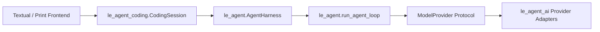
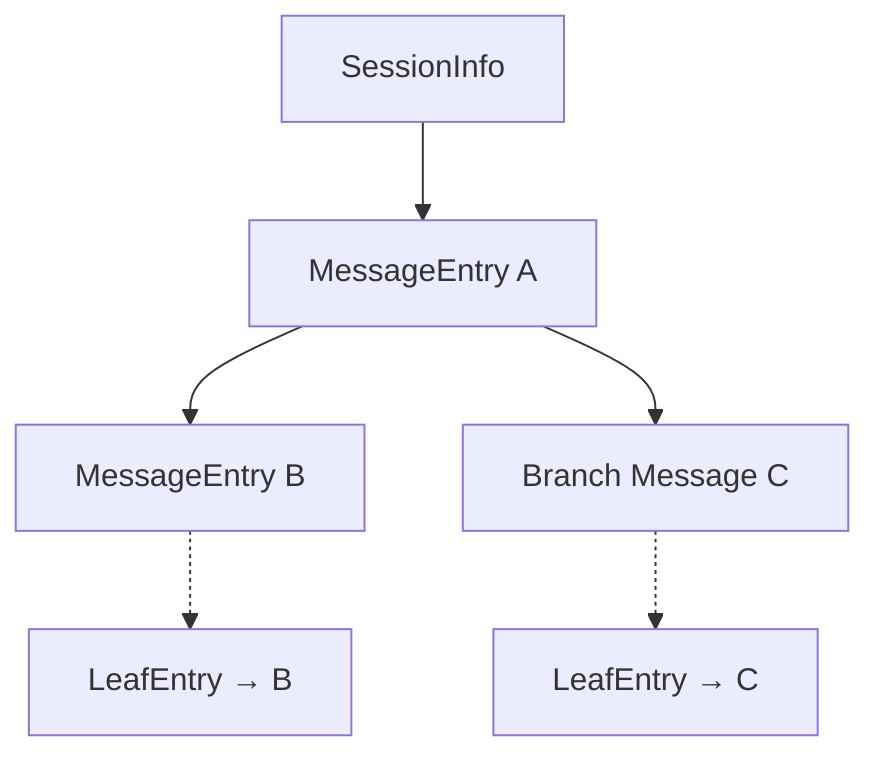
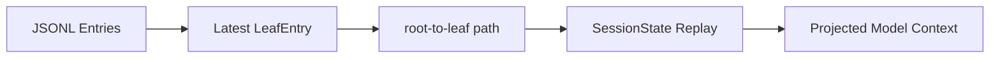

# LeAgent 开发岗位简历与面试手册

> 本文以当前仓库的源码和测试为事实源。简历数字应在投递前用当次 CI 结果替换，不保留容易过期的覆盖率和用例数。

## 1. le-agent：可直接投递的简历版本

### 1.1 标准版

**LeAgent｜Python Coding Agent Runtime｜个人项目**

**项目简介：** 参考 Pi 的极简 Harness 思想，从零实现面向 Coding 场景的 Python Agent Runtime，支持多模型流式接入、工具调用、分支会话、上下文压缩及 CLI/TUI 交互。

- 设计 `le_agent_ai / le_agent / le_agent_coding` 三层架构，以 Provider Interface 和分层 Message/Event 协议隔离模型通信、Agent Runtime 与 Coding 应用；通过事件流统一模型增量输出、工具执行与会话编排，使 Provider、Tool 及 CLI/TUI 可独立替换和测试。
- 实现异步 Agent Loop，打通 Streaming、ToolCall、ToolResult 与多轮推理闭环；支持 Steering、Follow-up、Cancel 及 before/after hooks，并对同批工具调用进行可控串并行调度。
- 设计 append-only JSONL Session Tree，以 `parent_id + leaf` 持久化会话分支，基于活动路径完成 Context Projection；通过增量 Compaction、recent tail 保留和单次 Overflow Retry 支持长会话恢复。
- 构建可扩展的 Tool/Skill 体系：以统一 Schema、Executor 和 Result 协议接入文件操作、Shell 与 Web Search；从用户和项目目录发现 Skills，仅将元数据注入 System Prompt，并在任务命中时按需加载正文，降低上下文开销。
- 完善运行可靠性：实现 Provider Retry、协作式取消和工具异常隔离；为中断产生的悬空 ToolCall 补齐 ToolResult，维持 ToolCall/ToolResult 配对不变量，使会话可恢复、可重放。

### 1.2 版面受限时的三条压缩版

**LeAgent｜Python Coding Agent Runtime｜个人项目**

- 设计 AI/Core/Coding 三层事件驱动架构，以 Provider Interface 与 Message/Event 协议隔离多模型通信、Agent Runtime 和 CLI/TUI。
- 实现 Streaming—ToolCall—ToolResult 多轮闭环和可控串并行 Tool batch，并以 Session Tree、Context Projection 和 Compaction 管理分支会话与长上下文。
- 构建 Tool/Skill 扩展体系与中断恢复机制，按需加载用户/项目 Skills，并通过 ToolCall/ToolResult 配对不变量保持会话可重放。

### 1.3 面向不同岗位的关键词

- **Agent 应用开发：** Coding Agent、Tool Calling、流式输出、上下文管理、多模型接入、Textual
- **Agent Runtime/Infra：** Agent Loop、Provider Adapter、事件协议、Session Tree、Context Projection、Compaction
- **Python 后端/AI 工程：** asyncio、Pydantic、协议抽象、文件锁、异常恢复、pytest、mypy strict

### 1.4 证据与表述边界

- 可以说“参考 Pi 的 Harness 思想”，但不把上游设计当作自己的原创。
- 工具并行是“保守的整批 barrier”，不是通用依赖图调度器；`write/edit/bash` 会使整批串行。
- `web_search` 返回搜索摘要和来源，不等于页面全文抓取、事实验证或引用正确性保证。
- Session Memory 指会话树、活动分支投影与上下文压缩，不等同于向量数据库、RAG 或跨用户长期记忆。

## 2. 从 LeAgent 提炼项目亮点

### 2.1 已能映射到 le-agent 的设计

| 设计 | 源码 | 当前状态 | 简历用法 |
| --- | --- | --- | --- |
| `le_agent_ai → le_agent → le_agent_coding` 分层 | `README.md`、`src/le_agent_coding/data/docs/architecture.md` | 已采用对应三包分层 | 可直接写入 |
| Provider-neutral Streaming | `src/le_agent/provider.py`、`src/le_agent_ai/stream.py` | 已实现 OpenAI-compatible/Codex/Mistral 统一流 | 可直接写入 |
| Pi-compatible Agent Loop | `src/le_agent/loop.py` | 已实现，包含可控并行 batch | 可直接写入 |
| Steering/Follow-up/Cancel | `src/le_agent/harness.py` | 已实现 | 可直接写入 |
| Append-only Session Tree | `src/le_agent/session/entries.py` | 已实现 | 可直接写入 |
| Active-path Context Projection | `src/le_agent/session/memory.py` | 已实现 | 可直接写入 |
| Recent-preserving Compaction | `src/le_agent_coding/context_window.py`、`session.py` | 已实现相近机制 | 可直接写入，但使用 le-agent 参数和恢复语义 |

### 2.2 值得展开的工程亮点

下列内容均有当前源码作为证据，适合在面试中展开设计取舍和能力边界。

#### 亮点 1：多 Transport Provider 层

LeAgent 接入 OpenAI-compatible Chat Completions/Responses、OpenAI Codex 订阅认证和 Mistral Conversations Transport。各 Adapter 统一输出 Provider Event，再转换为 Agent 层的 Assistant Event。

- **学习价值：** 理解“统一协议”不等于“所有厂商强行使用一种 HTTP 格式”。
- **证据：** `src/le_agent_ai/openai_compatible.py`、`openai_codex.py`、`mistral.py`

#### 亮点 2：可观察的 Provider Retry

LeAgent 对请求前或尚未输出内容时的瞬时 HTTP/网络失败进行有上限的指数退避，并发出 `ProviderRetryEvent`。取消信号可以中断等待。

- **学习价值：** 重试不是 Adapter 内部的黑盒睡眠，前端和诊断层能观察 attempt、delay 和原因。
- **证据：** `src/le_agent_ai/retry.py`、`src/le_agent_ai/_provider_events.py`

#### 亮点 3：持久化 LeafEntry

LeAgent 在持久化 MessageEntry 后追加 LeafEntry，分支导航也会写入 LeafEntry，因此重新加载 Session 时可以恢复活动分支。

- **学习价值：** 把“历史节点”和“当前指针”都做成追加事件，避免覆盖旧记录。
- **证据：** `src/le_agent/session/entries.py`、`src/le_agent_coding/session.py`

#### 亮点 4：Interrupted ToolResult Repair

如果取消或旧版本 Session 留下 ToolCall 却没有对应 ToolResult，LeAgent 会生成错误 ToolResult，并在加载时把修复结果持久化，避免 Provider 拒绝不完整 Transcript。

- **学习价值：** Tool Calling 的一致性不仅是 ID 对应，还要保证每个已发出的调用最终闭合。
- **证据：** `src/le_agent/harness.py`、`CodingSession._persist_loaded_interrupted_tool_repairs()`

#### 亮点 5：Extension Runtime

扩展可以注册 Tool、Slash Command、事件处理器，拦截或改写 ToolCall/ToolResult，并通过 UI Adapter 显示选择、确认和输入对话框。

- **学习价值：** 扩展能力放在 `le_agent_coding`，不让可复用 `le_agent` 依赖应用插件系统。
- **证据：** `src/le_agent_coding/extensions/api.py`、`loader.py`、`runtime.py`

#### 亮点 6：Skills、Prompt Templates 与 Project Context

LeAgent 从用户和项目资源目录加载 Skills、提示词模板及 AGENTS.md 等上下文文件，并在 System Prompt 或 Slash Command 边界组合。

- **学习价值：** Agent 的能力不只来自 Tool，还来自可发现、可注入的任务知识与项目规则。
- **证据：** `src/le_agent_coding/skills.py`、`prompt_templates.py`、`context.py`、`system_prompt.py`

#### 亮点 7：Provider Catalog、OAuth 与 Credential Refresh

LeAgent 用 Catalog 描述模型、Transport、Context Window、Thinking Level 和认证方式；OAuth Credential 在调用前解析，刷新过程按 Credential 加锁以避免并发刷新竞争。

- **学习价值：** “多模型支持”包括模型元数据、认证生命周期和 Runtime 构造，不只是切换 base URL。
- **证据：** `src/le_agent_coding/provider_catalog.py`、`provider_config.py`、`provider_runtime.py`、`oauth*.py`

#### 亮点 8：完整 Textual TUI 和事件适配层

LeAgent 的 Harness/CodingSession 只发事件，Textual TUI 通过 Adapter 和 State 消费事件，实现 Streaming Transcript、Tree、Theme、Autocomplete、文件拖放和终端通知。

- **学习价值：** TUI 是一种 Frontend，不是 Agent Core 的依赖。
- **证据：** `src/le_agent_coding/tui/adapter.py`、`state.py`、`app.py`、`widgets.py`

#### 亮点 9：Diagnostics 与 Session 运维能力

LeAgent 记录 Agent 调用阶段、异常和 Provider 错误，并提供 Session Index、Export、Stats、自动命名等应用能力。

- **学习价值：** 从“能跑”走向“可诊断、可恢复、可管理”。
- **证据：** `src/le_agent_coding/diagnostics.py`、`session_manager.py`、`session_export.py`、`session_stats.py`

### 2.3 针对岗位的选择

| 岗位 | 优先学习和表达 |
| --- | --- |
| Agent 应用开发 | Agent Loop、Tools、Skills、Extensions、TUI |
| Agent Runtime/Infra | Provider Event、Harness、Session Tree、Context Projection、Retry |
| Context/Memory | LeafEntry、SessionState、Compaction、Overflow Retry |
| Python 后端/AI 工程 | asyncio、JSONL、数据迁移、OAuth Refresh Lock、Diagnostics |

## 3. LeAgent 核心模块设计解析

### 3.1 三层架构：让可复用大脑与 Coding App 分离

**问题：** Provider SDK、Agent Runtime 和终端产品的变化频率不同，混在一起会让每个修改跨层扩散。

**LeAgent 实现：**

- `le_agent_ai`：厂商 Transport、HTTP、Retry 和 Provider-neutral Stream；
- `le_agent`：Message、Event、Tool、Loop、Harness 和 Session 模型；
- `le_agent_coding`：CodingSession、Tools、Provider Config、Resources、Extensions、Commands、Rendering 和 TUI。



**取舍与边界：** `le_agent` 不依赖 Typer、Rich、Textual、资源目录或厂商假设；CodingSession 不是第二个 Loop，而是在 Harness 外增加持久化、压缩、资源和应用策略。

**面试回答：** “我把 AgentHarness 看作可复用大脑，CodingSession 是 Coding Agent 环境，TUI 只是事件消费者。这样能单测 Runtime，也能替换 Frontend。”

**证据：** `README.md`、`src/le_agent_coding/data/docs/architecture.md`、`src/le_agent_coding/session.py`

### 3.2 Provider-neutral Streaming、Retry 与 OAuth

**问题：** 不同厂商的请求格式、Thinking、ToolCall、Usage、错误和认证差异明显，Core 不应处理 SDK 细节。

**LeAgent 实现：** `ModelProvider.stream_response()` 是 Agent 层协议；`le_agent_ai` Adapter 先输出 response start、text/thinking delta、tool call、retry、end/error 等事件，再由 Stream 转成 Pi-compatible Assistant Event。HTTP 错误详情会限制长度并避免泄露无关响应。

Retry 仅在安全阶段发生：请求失败或尚未输出内容时按指数退避重试；已经产生内容后不盲目重放。OAuth Credential 由 Runtime Provider 调用前解析，并用每个 Credential 的 asyncio Lock 协调刷新。

**取舍与边界：** LeAgent 没有 le-agent 的标准错误码枚举。Context Overflow 由 CodingSession 对 Assistant Error 文本进行 marker 识别。

**面试回答：** “统一的是 Agent 需要的事件和最终消息，不是把所有 Provider 强制转成同一原生 API。重试本身也作为事件暴露，便于 UI 和 Diagnostics 展示。”

**证据：** `src/le_agent/provider.py`、`src/le_agent_ai/_provider_events.py`、`stream.py`、`retry.py`、`src/le_agent_coding/provider_runtime.py`

### 3.3 Pi-compatible Agent Loop

**问题：** 一次模型调用不足以完成 Coding 任务；Runtime 必须处理 Streaming、ToolCall、ToolResult、下一轮和停止条件。

**LeAgent 实现：** Loop 发出 Agent/Turn/Message/ToolExecution 生命周期事件。Assistant 最终消息决定是否执行工具；每个 ToolResultMessage 被追加到 Transcript，供下一轮 Provider 使用。Steering 在当前工具链的轮次边界插入，Follow-up 只在原本即将结束时开启下一轮。

**当前 Tool 边界：** `run_agent_loop()` 默认按 assistant message 形成 batch。它先按源顺序做 preflight 和 before hook；批次中已知工具全部为 `parallel` 时并发执行，任一工具为 `sequential` 时整批串行。

**取舍与边界：** `read` 和 `web_search` 能并行，`write/edit/bash` 作为保守 barrier。这保证 transcript 可重放，但还不能识别不同文件的细粒度冲突域。

**面试回答：** “Loop 的难点不在 while，而在最终消息收敛、事件顺序、ToolCall 闭环、中途输入和取消语义。并行 worker 可按完成顺序发事件，但 ToolResult 仍按源顺序回填，因此同时获得吞吐量和可重放性。”

**证据：** `src/le_agent/loop.py`、`events.py`、`provider_events.py`

### 3.4 AgentHarness：队列、Cancel、Hooks 和中断修复

**问题：** 纯 Loop 不应持有产品状态，但实际 Agent 需要 Transcript、监听器、运行锁、中途输入和取消。

**LeAgent 实现：** Harness 是唯一可变 Transcript 所有者，并保证同一时间只有一个 Loop 修改它。Steering 与 Follow-up 使用两个 deque，支持 `one_at_a_time` 或 `all` drain。CancellationToken 传到 Provider 和 Tool。`before_tool_call` 可以阻断，`after_tool_call` 可以改写结果。

取消或恢复前，Harness 会扫描 Assistant ToolCall 与已有 ToolResult；缺失结果会补充 `Tool call interrupted by user`，保证 Transcript 符合 Provider 契约。CodingSession 加载旧 Session 时还会把修复结果写入 JSONL。

**取舍与边界：** Hooks 是可组合边界，不等于内置权限模型。是否确认、阻断或审计由 Coding App/Extension 决定。

**面试回答：** “Harness 把有状态大脑和纯 Loop 分开。Loop 可以函数级测试，Harness 负责队列、订阅、取消和 Transcript 完整性。”

**证据：** `src/le_agent/harness.py`、`src/le_agent_coding/session.py::_persist_loaded_interrupted_tool_repairs`

### 3.5 Append-only Session Tree 与持久化 LeafEntry

**问题：** 线性 messages 无法同时表达分支、回退、历史审计和重启后的活动位置。

**LeAgent 实现：** 所有 Session Entry 都有 `id / parent_id / timestamp`。Message、Model Change、Thinking Level、Compaction、Branch Summary、Label、Leaf、Session Info 和 Custom Data 都是判别联合类型。MessageEntry 推进历史，LeafEntry 单独记录当前活动节点。



重新加载时寻找最新 LeafEntry，以 `entry_id` 选择活动节点。`path_to_entry()` 沿 parent 反向追到 root，检测重复 ID、缺失节点和循环后反转。

**持久化边界：** JsonlSessionStorage 逐行 append，Pydantic TypeAdapter 严格解析，并在反序列化边界迁移 LeAgent v1 Message；它没有 `flock`、`fsync` 或残缺末行自动恢复。

**面试回答：** “历史 Entry 和 Leaf Pointer 都追加而不覆盖。这样可以保留分支并恢复活动位置，但当前 Storage 的并发写与 torn-write 恢复仍是明确短板。”

**证据：** `src/le_agent/session/entries.py`、`tree.py`、`jsonl.py`、`storage.py`

### 3.6 SessionState 与 Context Memory

**问题：** 持久化 Session 包含多条分支和非消息事件，不能直接全部发给模型。

**LeAgent 实现：** `SessionState.from_entries(entries, leaf_id=...)` 只重放 root-to-leaf 路径，并投影出 messages、model、thinking_level、label、active_leaf_id、compaction_entries 与 context_entry_ids。

CompactionEntry 通过 `replaces_entry_ids` 指定被摘要替代的消息。重放时 `_apply_compaction()` 在第一处被替换位置插入 Summary UserMessage，保留未替换的 recent messages。BranchSummaryEntry 也会转换为特定 UserMessage。



**取舍与边界：** 这是可追溯的 Session/Context Memory，不做向量相似度检索，也不自动跨 Session 召回用户知识。

**面试回答：** “完整历史是存储事实，模型上下文是活动路径的投影；两者分离后，分支切换和压缩不会要求删除历史。”

**证据：** `src/le_agent/session/memory.py`、`tree.py`

### 3.7 Context Accounting、Compaction 与 Overflow Retry

**问题：** Context Window 有限；纯字符截断可能破坏 ToolCall/ToolResult 闭环，只保留摘要又会丢失近期任务状态。

**LeAgent 实现：** Context 估算优先采用最新有效 Assistant Usage 作为 Prefix 锚点，只估算之后新增的消息和动态 Tool；没有 Usage 时估算 System、Messages 与 Tools。自动阈值为 Context Window 减 Reserve。

Recent-preserving Plan 从活动 Context Rows 中选择旧前缀作为 `replaces_entry_ids`，保留近期消息。模型生成摘要时，如果第一条已经是上次摘要，会使用 Update Summary Prompt 增量更新。CompactionEntry 和新的 LeafEntry 追加后，SessionState 重放得到 Summary + Recent Context。

Provider 报错文本命中 Context Overflow marker 后，CodingSession 发出 Compaction Start/End；压缩成功则发出 AutoRetry Start，并 `continue_()` 一次，最后发出 AutoRetry End。当前最多自动重试一次，避免无限恢复循环。

**取舍与边界：** Overflow 识别依赖错误文本 marker，不是标准错误码；AutoRetryEnd 当前表示流程执行结束，不应过度解释为模型结果质量保证。

**面试回答：** “预测性 auto compaction 减少超限，反应式 overflow compaction 兜底；只重试一次是为了在自动恢复和无限循环风险之间取平衡。”

**证据：** `src/le_agent_coding/context_window.py`、`session.py`、`events.py`

### 3.8 CodingSession、Tools、Extensions、Skills 与 TUI

**问题：** Agent Core 之外还需要项目规则、文件工具、模型配置、插件、持久化和交互界面；这些不应反向污染 Harness。

**LeAgent 实现：** CodingSession 在 Harness 外编排资源加载、System Prompt、默认 Tools、Provider Runtime、Session Entry、Compaction、Diagnostics 和 Extensions。read/write/edit/bash 使用 JSON Schema 和显式 ToolInputError 校验；web_search 通过可注入 Backend 返回结构化来源。

Extensions 可组合 Tool、Command、事件与 Hooks；Skills、Prompt Templates 和 Project Context 从资源路径加载；Textual TUI 通过 Adapter 消费 CodingSession Event。

**安全边界：** `_path_arg()` 允许绝对路径，相对路径只以 cwd 解析。LeAgent 当前没有 workspace/symlink containment，也没有 readonly/confirm/trust 三级权限。Project Extensions 默认关闭，因为加载后执行任意 Python。

**面试回答：** “LeAgent 把应用能力放在 CodingSession 周围，并保持 Event 作为 Frontend 边界。它有取消、超时、截断和 Extension Hook，但不能把这些说成文件系统沙箱。”

**证据：** `src/le_agent_coding/session.py`、`tools.py`、`extensions/`、`skills.py`、`tui/`

## 4. 项目介绍话术

### 4.1 le-agent：30 秒版本

> LeAgent 是我参考 Pi 类极简 Harness 思想搭建的 Python Coding Agent Runtime。它实现多 Provider 流式协议、可控串并行 Agent Loop、Tavily web search 和 Session Tree。会话层用活动分支投影与 Compaction 管理 Context，工具结果按源顺序回填以保证可重放性。

### 4.2 le-agent：90 秒版本

> 我做 le-agent 是为了理解 Coding Agent 在模型 API 之外真正需要的 Runtime 能力，所以没有把 LangChain 作为核心，而是自己定义 Message/Event、Provider、Agent Loop、Tool、Session 和 Compaction。
>
> 架构分为 AI、Agent、Coding 三层。AI 层统一 OpenAI-compatible、Codex 和 Mistral；Agent 层负责流式 Loop、工具 batch、Steering/Follow-up/Cancel；Coding 层负责文件、Shell、Web Search、资源和 Textual。最有特点的是 append-only Session Tree：用 parent_id 和活动 leaf 表达分支，再把当前路径投影为模型 Context。
>
> 工程上用 Fake Provider 和 Fake WebSearchBackend 做确定性测试，覆盖并行完成顺序、稳定 transcript、Hook、取消、限流与结构化引用。当前边界是整批串并行 barrier、协作式取消和无系统级 sandbox。

### 4.3 LeAgent 源码学习：30 秒版本

> 我深入学习了 LeAgent 这个 Pi 风格的 Python Coding Agent。它把 Provider、可复用 Agent Harness 和 Coding App 分成 le_agent_ai、le_agent、le_agent_coding 三层。我重点读了事件驱动 Agent Loop、Steering/Follow-up 队列、append-only Session Tree、持久化 LeafEntry、SessionState Context Projection，以及 recent-preserving Compaction 和 Overflow 单次重试。这些源码帮助我重新审视了 le-agent 的状态边界和可扩展性。

### 4.4 “你从 LeAgent 学到了什么”90 秒版本

> 我最大的收获是分清了 Durable History、Runtime State 和 Model Context。LeAgent 用 Session Entry 保存完整历史，用 LeafEntry 保存活动指针，再从 root-to-leaf 路径重建 SessionState；模型最终看到的只是这条路径经过 Compaction 后的投影。这比把所有内容塞进 messages 数组更容易支持分支和恢复。
>
> 第二个收获是分层。AgentHarness 只负责可复用大脑，CodingSession 才负责资源、持久化、压缩、Extensions 和 TUI。Provider Retry、Tool Execution、Compaction 和 Auto Retry 都通过事件暴露，因此前端不用侵入 Core。
>
> 我也注意到它的真实边界：工具调度使用整批 barrier，尚未按路径冲突做部分并行；文件工具没有 workspace 沙箱；JSONL 没有进程锁和 torn-write 恢复；web search 也是外部网络与配额故障域。

## 5. LeAgent 源码级技术难点与验证思路

### 5.1 AgentHarness 与 CodingSession 为什么分层

- **LeAgent：** Harness 管 Transcript、队列、取消和 Loop；CodingSession 管资源、持久化、Compaction、Provider Runtime 和应用事件。
- **价值：** 同一个 Harness 可以嵌入 CLI、TUI 或其他 Host，Core 测试不需要 Textual。
- **验证重点：** Core 不读取配置目录、不创建 TUI Widget，资源装配留在 Coding 层。

### 5.2 Steering 与 Follow-up 的双队列

- **LeAgent：** Steering 在工具链轮次边界尽快注入；Follow-up 只在本次运行本来要结束时开启新轮次。
- **价值：** 两种“用户追加输入”具有不同调度语义，不能只用一个 pending list。
- **验证重点：** 覆盖 one-at-a-time/all 两种 drain 策略和 UI 可见的 QueueUpdate Event。

### 5.3 为什么 LeafEntry 独立存在

- **LeAgent：** 业务 Entry 记录发生了什么，LeafEntry 记录当前选择哪条分支；两者都 append-only。
- **价值：** 分支导航不修改历史，重启后仍能恢复活动指针。
- **验证重点：** 分支导航追加 LeafEntry，重启后恢复最新活动指针。

### 5.4 SessionState 如何投影 Context

- **LeAgent：** 先根据 LeafEntry 找 root-to-leaf path，再重放 Model/Thinking/Message/Compaction 等 Entry。
- **价值：** Durable History 与 LLM Request 解耦，其他分支不会污染当前请求。
- **验证重点：** 活动路径投影对循环、缺失父节点与重复 ID 都显式失败。

### 5.5 Compaction 为什么使用 replaces_entry_ids

- **LeAgent：** CompactionEntry 显式列出被摘要替换的 Context Entry，而不是按数组下标隐式截断。
- **价值：** 投影过程可解释，未被替换的 recent messages 继续保留。
- **验证重点：** `replaces_entry_ids` 只改变 Context Projection，不删除历史 Entry，recent tail 保留。

### 5.6 Overflow 为什么只重试一次

- **LeAgent：** 文本识别 Overflow → recent-preserving compaction → `continue_()` 一次。
- **价值：** 可以自动恢复常见超限，又避免摘要无效时无限循环和重复收费。
- **验证重点：** UI 区分 Harness End、Auto Retry Event 与 Session Settled，且 overflow 最多自动重试一次。

### 5.7 Interrupted ToolResult Repair

- **LeAgent：** Harness 在新运行前补内存 ToolResult，CodingSession 加载时把旧 Session 修复持久化。
- **价值：** Provider Transcript 契约在取消、崩溃和版本升级后仍闭合。
- **验证重点：** 恢复测试覆盖“Assistant ToolCall 没有对应 ToolResult”，不只测正常工具链。

### 5.8 Extension Runtime 为什么不放进 Core

- **LeAgent：** Extensions 属于 le_agent_coding，可以注册 Tool/Command/Event/Hook/UI；le_agent 只暴露稳定 Tool 和 Event 协议。
- **价值：** 插件系统的加载、信任和 UI 复杂度不会污染可复用大脑。
- **验证重点：** 项目扩展默认关闭，文档明确其任意 Python 执行风险。

## 6. 高频问答、差异表与 LeAgent 源码证据索引

### 6.1 高频面试问答

#### Q1：LeAgent 的三层分别负责什么？

`le_agent_ai` 负责 Provider Transport 与统一 Stream；`le_agent` 负责可复用的 Message、Event、Tool、Loop、Harness、Session；`le_agent_coding` 把大脑包装成 Coding App，加入配置、资源、持久化、Extensions、Commands 和 TUI。依赖方向是 `le_agent_coding → le_agent → le_agent_ai`。

#### Q2：CodingSession 是不是第二个 Agent Loop？

不是。真正的模型—工具循环只有 `run_agent_loop()`。CodingSession 在外层处理应用策略，例如持久化 MessageEnd、自动压缩、Overflow Retry、Session Naming、Diagnostics 和 Extension Event。

#### Q3：LeAgent 当前工具调用是并行还是串行？

两者都支持。默认全局模式为 `parallel`；同一 batch 只有在所有已知工具都是 `parallel` 时才并发，任一 `sequential` 工具会使整批串行。

#### Q4：execution_mode 如何保证并行时的确定性？

Loop 先按源顺序发 start 事件、准备参数并运行 before hook；worker 可并发完成，update/end 按实际时序观测；整批收敛后再按 ToolCall 源顺序追加 ToolResultMessage。

#### Q5：LeAgent 怎样校验工具参数？

Provider 看到的是 JSON Schema；Tool Executor 收到 `Mapping[str, JSONValue]` 后，由 `_str_arg`、`_optional_float_arg`、Edit 参数规范化等函数显式校验并抛 ToolInputError。Pydantic 用于 WireModel 和 Session Entry，但不是每个 Tool 的独立 args model。

#### Q6：Steering 和 Follow-up 有什么区别？

Steering 在当前工具链的 Turn 边界注入，尽快改变正在进行的任务；Follow-up 在当前运行原本即将结束时再开启下一轮。Harness 为两者维护独立 deque，并可一次取一条或全部取出。

#### Q7：Cancel 后为什么要补 ToolResult？

Assistant 已发出 ToolCall 但没有 ToolResult 时，许多 Provider 会拒绝后续 Transcript。Harness 会为缺失 ID 补错误 ToolResult；CodingSession 加载历史时还会把修复写入 Session，保证下次恢复仍然有效。

#### Q8：LeAgent Session Tree 的核心是什么？

所有 Entry 通过 parent_id 构成追加式树，LeafEntry 持久化活动节点。读取时从最新 LeafEntry 的 entry_id 沿父链回到 root，再反转得到活动路径；历史分支不删除。

#### Q9：LeafEntry 与 MessageEntry 为什么分开？

MessageEntry 表示对话事实，LeafEntry 表示导航状态。分开后移动指针不需要重写消息节点，也能把多次导航作为追加历史保存。

#### Q10：SessionState 是 Memory 吗？

它属于 Session/Context Memory：从活动路径派生 messages、model、thinking level 和 context entry IDs。它不包含 Embedding、向量检索或跨 Session 用户画像。

#### Q11：CompactionEntry 怎样替换旧 Context？

它保存 summary 和 replaces_entry_ids。SessionState 重放时删除这些 ID 对应的 Message Row，并在第一个替换位置插入 Summary UserMessage；未替换的 recent rows 保留。

#### Q12：Token 是怎样估算的？

优先使用最近一次成功 Assistant Usage 作为已知 Prefix，只估算其后的消息和动态新增 Tools；没有 Usage 时按 System、Message 和 Tool Schema 的字符/固定开销估算。

#### Q13：Context Overflow 怎样恢复？

CodingSession 从 Assistant Error 文本中匹配 context markers，生成 recent-preserving compaction。成功后自动 `continue_()` 一次，并发出 Compaction 和 AutoRetry 生命周期事件；失败则不无限重试。

#### Q14：LeAgent Provider Retry 与 Overflow Retry 一样吗？

不一样。Provider Retry 位于 le_agent_ai，处理请求前或未输出内容时的瞬时 HTTP/网络失败；Overflow Retry 位于 CodingSession，需要先改变 Context，再重新运行一次 Agent。

#### Q15：LeAgent 的 JSONL 有哪些可靠性能力？

它是 append-only，使用 Pydantic 判别联合严格反序列化，并在 JSONL 边界迁移 v1 Message。当前没有跨进程锁、fsync 和 torn final line 自动恢复，非法行会抛 SessionJsonlError。

#### Q16：LeAgent 的文件工具有工作区沙箱吗？

没有。相对路径以 cwd 解析，但绝对路径被允许，也没有统一的 `relative_to(workspace)` containment。当前安全能力主要是参数校验、Bash 超时/取消、输出截断、同进程文件写锁和 Extension Hook。

#### Q17：LeAgent 有内置权限模式吗？

没有 readonly/confirm/trust 三级权限。Extension `before_tool_call` 可以阻断或改写调用，UI Extension 可以发起确认，但这是扩展机制，不是内置统一权限策略。

#### Q18：Skills 和 Extensions 有什么区别？

Skills 主要提供可发现的任务说明并注入 Prompt；Extensions 是可执行 Python，可以注册 Tool、Command、Hook、Event 和 UI 交互。Extensions 权限更高，因此项目 Extensions 默认不启用。

#### Q19：为什么 TUI 不直接调用 Agent 内部方法？

LeAgent 以事件作为边界，TUI Adapter 把 CodingSession Event 映射成前端 State 和 Widget 更新。这样 Print Renderer、JSON Renderer 或 Textual 都能消费同一 Runtime，而 Core 不依赖 UI。

#### Q20：你如何证明自己真的读过 LeAgent？

不要背功能列表。应能现场说明：并行批次的 preflight/事件/回填顺序、web search 的结构化引用与配额边界、LeafEntry 持久化、SessionState 活动路径重放、Compaction 与 Overflow 单次重试。

### 6.2 当前实现与能力边界

| 主题 | 已实现 | 边界 |
| --- | --- | --- |
| Provider | OpenAI-compatible、OpenAI Codex、Mistral | 原生 Anthropic/Google 未内置，可经兼容网关接入 |
| Tool 调度 | 只读 batch 并行，结果按源顺序回填 | 任一 sequential 工具使整批串行 |
| Web search | Tavily、结构化引用、freshness/域名过滤、可禁用 | keyless 是 best-effort，不提供全文抓取或事实保证 |
| Session | LeafEntry、活动路径投影、Compaction/Overflow Retry | JSONL 无事务、跨进程锁和 torn-tail 修复 |
| 安全 | Hook 可审批/阻断，项目 Extension 默认禁用 | 无统一权限模式或系统级 sandbox |

### 6.3 LeAgent 源码证据索引

| 阅读顺序 | 学习主题 | LeAgent 源码位置 | 面试重点 |
| --- | --- | --- | --- |
| 1 | 总体架构 | `README.md`、`src/le_agent_coding/data/docs/architecture.md` | 三层职责和依赖方向 |
| 2 | Message/Event | `src/le_agent/messages.py`、`events.py`、`provider_events.py` | Provider Event 与 Agent Event 的边界 |
| 3 | Provider Protocol | `src/le_agent/provider.py`、`src/le_agent_ai/provider.py` | Core 只依赖 Protocol |
| 4 | Provider Stream | `src/le_agent_ai/stream.py`、`_provider_events.py` | 增量事件如何收敛为 AssistantMessage |
| 5 | Provider Adapters | `src/le_agent_ai/openai_compatible.py`、`openai_codex.py`、`mistral.py` | 厂商 Transport 差异 |
| 6 | Retry/HTTP Error | `src/le_agent_ai/retry.py`、`http_errors.py` | 何时能安全重试、如何暴露进度 |
| 7 | Agent Loop | `src/le_agent/loop.py` | Tool batch、并行事件、稳定回填顺序 |
| 8 | AgentHarness | `src/le_agent/harness.py` | Transcript、队列、Cancel、修复 |
| 9 | Tool Protocol | `src/le_agent/tools.py` | Schema、Executor、progress、execution_mode 边界 |
| 10 | Session Entry | `src/le_agent/session/entries.py` | parent_id、LeafEntry、CompactionEntry |
| 11 | Tree Traversal | `src/le_agent/session/tree.py` | root-to-leaf、循环/缺失/重复检测 |
| 12 | SessionState | `src/le_agent/session/memory.py` | 活动分支重放与 Context Projection |
| 13 | JSONL/Migration | `src/le_agent/session/jsonl.py`、`storage.py` | 严格解析、v1 Migration、可靠性边界 |
| 14 | CodingSession | `src/le_agent_coding/session.py` | Harness 外的应用编排 |
| 15 | Context Window | `src/le_agent_coding/context_window.py` | Usage Anchor、估算、Summary Prompt |
| 16 | Coding Tools | `src/le_agent_coding/tools.py`、`web_search.py` | read/write/edit/bash/web_search、串并行元数据、取消与安全边界 |
| 17 | Provider Runtime | `src/le_agent_coding/provider_catalog.py`、`provider_config.py`、`provider_runtime.py` | Catalog、Model Metadata、OAuth Refresh |
| 18 | Extensions | `src/le_agent_coding/extensions/api.py`、`loader.py`、`runtime.py` | Tool/Command/Event/Hook/UI 与信任边界 |
| 19 | Resources | `src/le_agent_coding/skills.py`、`prompt_templates.py`、`context.py`、`system_prompt.py` | Skills、Templates、Project Context 如何组合 |
| 20 | Diagnostics | `src/le_agent_coding/diagnostics.py`、`events.py` | 阶段化日志和应用事件 |
| 21 | Session 运维 | `src/le_agent_coding/session_manager.py`、`session_export.py`、`session_stats.py` | Index、Export、Stats |
| 22 | Textual TUI | `src/le_agent_coding/tui/adapter.py`、`state.py`、`app.py`、`widgets.py` | Event Adapter、State、渲染边界 |
| 23 | 测试 | `tests/test_agent_loop.py`、`test_coding_session.py`、`test_session.py`、`test_extensions.py` | 用 Fake Provider/Tool 验证状态机 |

### 6.4 推荐学习顺序

1. 先读 Architecture、Message/Event 和 Tool Protocol，建立词汇表；
2. 顺着 `AgentHarness.prompt → run_agent_loop → ModelProvider.stream_response` 跟一遍正常工具调用；
3. 顺着 `CodingSession.prompt → MessageEnd → MessageEntry/LeafEntry` 跟一遍持久化；
4. 用一份分支 JSONL 手工推演 `path_to_entry → SessionState.from_entries`；
5. 跟踪 Auto Compaction 和 Overflow Retry，画出事件时间线；
6. 最后读 Extensions、Skills 和 TUI，理解应用层如何消费 Core。

### 6.5 工程验证

投递或面试前在当前仓库验证：

```bash
uv run python -c 'import sys; sys.path.insert(0, "src"); import pytest; raise SystemExit(pytest.main(["-q"]))'
uv run ruff check .
uv run mypy src/le_agent_ai src/le_agent src/le_agent_coding
```

记录当次实际输出，不在文档中长期缓存 passed/skipped/覆盖率数字。本次文档审查已确认 pytest 可收集 1386 个用例。

### 6.6 最终记忆点

面试官应当听到四个清晰结论：

1. 你有一个实际实现并测试过的 le-agent 项目；
2. 你能从源码解释 LeAgent 的 Loop、Harness、Session Tree 和 Context Projection；
3. 你知道 LeAgent 的真实边界，不会把字段、规划或扩展点误说成已实现功能；
4. 你能指出实现边界，并提出有证据的改进方案。
