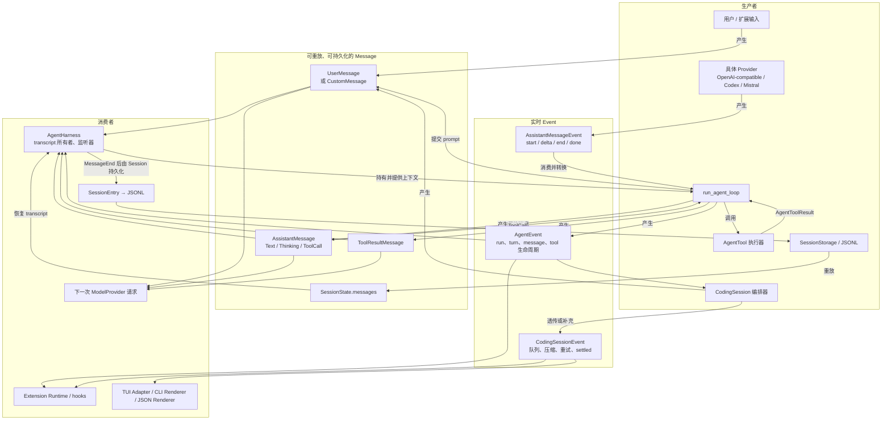
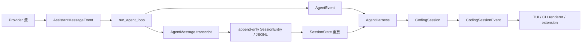

# LeAgent 的 Message 与 Event 架构设计

> 基于当前 `src/le_agent`、`src/le_agent_ai` 与 `src/le_agent_coding` 的实现整理（2026-08-20）。

## 一句话理解

LeAgent 将**消息（Message）**和**事件（Event）**分开：

- Message 是会话中已经发生的、可保存和再次交给模型的事实（transcript）。
- Event 是一次运行中发生的、按时间顺序发出的状态通知，供 TUI、CLI、扩展等消费者即时响应。

因此，流式文本、工具进度、压缩和重试可以立即展示；最终的用户输入、模型回复和工具结果则会进入持久化会话历史。两者不能混用：事件不是会话记录，消息也不等于 UI 的临时状态。

## 生产者与消费者总览



读取方式：实线经过 `UserMessage`、`AssistantMessage`、`ToolResultMessage` 的路径是会话事实链路；`AssistantMessageEvent`、`AgentEvent` 和 `CodingSessionEvent` 则是“产生后立即消费”的运行时通知链路。最终消息写入 JSONL，流式 delta 不写入持久化记录。



## 1. 三层职责与依赖方向

项目遵循 `le_agent_ai → le_agent → le_agent_coding` 的单向分层。

| 层 | 核心职责 | Message / Event 角色 |
| --- | --- | --- |
| `le_agent_ai` | 对接 OpenAI-compatible、OpenAI Codex 与 Mistral 协议，产生统一流 | 使用 `le_agent` 定义的 assistant 流事件 |
| `le_agent` | 可复用的 agent brain：调用模型、执行工具、维护循环协议 | 定义 provider-neutral 的消息、流事件、Agent 事件和 Harness |
| `le_agent_coding` | Coding Agent 的应用编排、持久化、扩展、CLI/TUI | 透传 Agent 事件，并补充压缩、重试、队列等会话事件 |

一个刻意的依赖约束是：`le_agent` 不导入 `le_agent_ai`。Provider 在 `le_agent.provider.ModelProvider` 协议后面实现，Agent 核心因此不绑定任何模型厂商或 UI。

## 2. Message：可重放的对话事实

### 2.1 统一 wire model

所有核心消息都继承 `WireModel`（`src/le_agent/messages.py`）：

- Python 内部字段用 `snake_case`；JSON wire format 自动序列化为 `camelCase`；
- 同时接受两种命名以方便 Python 构造和 JSON 反序列化；
- `extra="forbid"` 拒绝未知字段，避免拼错字段后被静默忽略；
- 联合类型均以判别字段解析，消息以 `role` 判别、事件以 `type` 判别。

这使 Provider、会话 JSONL 和前端面对同一份稳定协议，而不是各自维护字段转换。

### 2.2 消息类型

`AgentMessage` 是按 `role` 判别的联合类型，主要成员如下：

| 消息 | `role` | 作用 |
| --- | --- | --- |
| `UserMessage` | `user` | 文本或文本+图片的用户输入 |
| `AssistantMessage` | `assistant` | 模型完整回复、模型元信息、用量与停止原因 |
| `ToolResultMessage` | `toolResult` | 对应某次工具调用的执行结果，必须回填模型上下文 |
| `BashExecutionMessage` | `bashExecution` | Shell 执行记录，可指定不进入模型上下文 |
| `CustomMessage` | `custom` | 扩展或应用拥有的消息，可控制是否展示 |
| `BranchSummaryMessage` | `branchSummary` | 分支摘要 |
| `CompactionSummaryMessage` | `compactionSummary` | 上下文压缩摘要 |

`AssistantMessage.content` 是按生成顺序保存的块列表，而不是一个字符串：

```text
TextContent | ThinkingContent | ToolCall
```

这样既能保留“思考 → 文本 → 工具调用”等实际顺序，又能携带结构化工具参数。`UserMessage` 与 `ToolResultMessage` 则可包含 `TextContent | ImageContent`。为了方便 Python 调用，后两类接受字符串构造；但存储和协议输出始终规范化为块列表。

### 2.3 工具调用为何要变成消息

模型在 `AssistantMessage` 中产生 `ToolCall(id, name, arguments)` 后，Loop 执行对应 `AgentTool`，先得到运行时结果 `AgentToolResult`，再封装为 `ToolResultMessage`：

```text
AssistantMessage.ToolCall
  → ToolExecutionStart / Update / End（实时观察）
  → ToolResultMessage（持久事实，带 tool_call_id）
  → 下一次 provider 请求的 messages
```

这里的关键不变量是：工具结果不能只渲染到屏幕上，必须写入 transcript。这样模型的下一回合才能看到命令输出、文件内容或错误，并将多个工具结果与调用 ID 正确关联。被阻止、找不到、抛异常或被取消的工具也会生成错误结果，而不是破坏这条关联。

## 3. Event：分层的运行时通知

### 3.1 Provider / Assistant 流事件

`le_agent.provider_events.AssistantMessageEvent` 描述一次模型回复内部的细粒度流。所有事件带有 `partial: AssistantMessage` 快照，因而消费者既可使用 `delta` 做增量渲染，也可只采用当前完整快照恢复状态。

生命周期分为三类内容块的 `start → delta → end`：

- 文本：`text_start`、`text_delta`、`text_end`
- 推理：`thinking_start`、`thinking_delta`、`thinking_end`
- 工具调用：`toolcall_start`、`toolcall_delta`、`toolcall_end`

终结事件为：

- `done`：携带完整 `AssistantMessage`，原因是 `stop`、`length` 或 `toolUse`；
- `error`：携带错误或中止的 `AssistantMessage`，原因是 `error` 或 `aborted`。

`le_agent_ai.events` 只重新导出这一套 canonical 事件类，而不复制一份定义；这保证不同 Provider 的流事件可互换。

### 3.2 Agent 事件

`run_agent_loop()` 将 provider 流提升为 `AgentEvent`，增加 agent 层的生命周期语义：

| 类别 | 事件 |
| --- | --- |
| 整次运行 | `agent_start` → `agent_end(messages)` |
| 模型回合 | `turn_start` → `turn_end(message, tool_results)` |
| 消息生命周期 | `message_start` → 零或多个 `message_update` → `message_end` |
| 工具生命周期 | `tool_execution_start` → 零或多个 `tool_execution_update` → `tool_execution_end` |

其中 `MessageUpdateEvent` 将 assistant 的细粒度流事件嵌套在 `assistant_message_event` 字段中。Agent 层不丢失 token/block 级信息，但前端也不必理解 Provider 实现。

`message_end` 是重要边界：它表示该消息已成为确定的最终消息；与之相对，`message_update` 只是临时流状态，不应写入会话记录。

### 3.3 CodingSession 事件

`CodingSession` 大多数情况下直接透传 `AgentEvent`，同时添加 coding 应用才需要的编排事件：

- `queue_update`：steering 和 follow-up 队列的快照；
- `compaction_start` / `compaction_end`：手动、阈值或 overflow 压缩；
- `auto_retry_start` / `auto_retry_end`：overflow 恢复后的重试；
- `agent_end`（`SessionAgentEndEvent`）：Harness 本轮结束，附带是否会重试；
- `agent_settled`：压缩、重试、队列等所有会话编排均已结束，前端此时才可安全退出 loading。

要注意 Agent 层也有 `AgentEndEvent`。Coding 层会将它替换为 `SessionAgentEndEvent`，避免 UI 在可能仍要压缩或重试时过早认为任务已完成。

## 4. 一次 prompt 的完整流转

`CodingSession.prompt()` 的典型时序如下：

1. Session 先执行扩展 input hooks，并展开 prompt/template；必要时自动压缩上下文。
2. Session 创建 `UserMessage`（扩展输入可创建 `CustomMessage`），交给 `AgentHarness.prompt_message()`。
3. Harness 独占可变 transcript，创建取消令牌，并把消息队列的 drain 回调注入无状态的 `run_agent_loop()`。
4. Loop 先将 prompt 写入 transcript，发出其 `message_start` / `message_end`；随后调用 `ModelProvider.stream_response()`。
5. Provider 的 start/delta/end 被转换为消息生命周期事件；最终 `AssistantMessage` 写入 transcript。
6. 如果 assistant 含 `ToolCall`，Loop 将它们视为一个 batch。它按源顺序运行 preflight/before hook，依 `tool_execution` 和工具 `execution_mode` 选择串行或并行，最后按源顺序将 `ToolResultMessage` 写回 transcript。
7. 没有新工具和排队消息后，Loop 发出 `agent_end`。Session 在每个 `message_end` 后将新消息增量持久化，并最终发出 `SessionAgentEndEvent` 与 `agent_settled`。

Steering 与 follow-up 的调度位置不同：

- `steer()`：当前工具回合结束后尽快进入下一次模型请求；
- `follow_up()`：当前模型—工具链自然结束后，作为新输入继续同一个大 run；
- `queue_mode="one_at_a_time"` 默认逐条排空，让模型有机会逐条回应；`"all"` 则一次性取出当前队列快照。

## 5. 会话持久化与恢复

持久化不是覆盖一份 transcript，而是追加式会话树：

```text
MessageEntry(parent_id=上一节点, message=最终消息)
  → LeafEntry(entry_id=该消息节点)
  → JSONL
```

`SessionEntry` 还可记录模型切换、thinking level、压缩、分支摘要、标签、会话信息和扩展数据。每条记录都有 `id`、`parent_id` 和时间戳；沿 leaf 的 `parent_id` 回溯后再反转，就能获得当前分支的重放顺序。

`SessionState.from_entries()` 用这些 entries 重建 `messages` 等运行态。压缩不会改写旧消息：`CompactionEntry` 指明被替代的 entry ID，重放时将它们替换为一条摘要用户消息。JSONL 反序列化边界还负责旧 LeAgent-v1 格式迁移；离开该边界后，运行时只处理当前严格的 canonical 协议。

恢复或取消时，Harness 会检查“已有 ToolCall 但没有 ToolResultMessage”的悬空调用，并补写错误结果，从而维持“每个工具调用都有结果”的 transcript 不变量。

## 6. 前端如何消费事件

`TuiEventAdapter` 只是把事件单向投影到 `TuiState`，不拥有 transcript，也不会反向控制 Harness：

- `AgentStartEvent`：进入 running；
- `MessageUpdateEvent` 中的 `TextDeltaEvent`：追加临时文本缓冲；`ThinkingDeltaEvent`：追加思考展示；
- `MessageEndEvent`：用最终 canonical message 替换临时流式展示；
- `ToolExecution*Event`：创建、更新、完成工具调用展示；
- `QueueUpdateEvent`：刷新队列徽标/内容；
- `AgentSettledEvent`：清空缓冲并退出 running。

这种“事件 → UI 状态”的单向投影让 Textual TUI、print mode 和 JSON renderer 共用同一个 Agent/Session 核心。渲染器可选择只消费最终 `message_end`，也可利用 `message_update` 实现逐 token 的体验。

## 7. 设计要点与实践准则

1. 新增可被模型看到、需要恢复的对话信息时，优先设计为 `AgentMessage`；不要只发一个 UI event。
2. 新增短暂进度、界面状态或编排通知时，设计为 Event；不要污染 transcript。
3. Provider 适配器只负责产出标准 `AssistantMessageEvent`；不要把厂商事件泄漏进 Harness 或 UI。
4. 所有流式内容最终必须收敛为一个完整 `AssistantMessage`，再以 `message_end` 确认。
5. 工具失败、中止和 Provider 错误也要用规范消息表示；错误是可诊断的历史，而不是绕过协议的异常分支。
6. 持久化以最终消息为准，绝不持久化 delta；扩展旧协议兼容逻辑应收敛在 JSONL 读取边界。
7. 前端在 `agent_end` 后仍可能等待编排；应以 `agent_settled` 作为真正恢复可交互状态的信号。
8. 并行工具的 update/end 事件可按完成顺序到达；持久化的 ToolResult 依然按源 ToolCall 顺序，不把调度时序混入可重放历史。

`web_search` 是该分层的一个例子：Tavily 协议和结果归一化位于 `le_agent_coding`，
Loop 只看到一个 `execution_mode="parallel"` 的标准 AgentTool，Message/Event 协议无需为搜索特化。

## 8. 面试延伸：评测、Hooks 与编排选择

### Q8：怎么校验 Agent 确定性的结果？

先澄清：LLM 的输出不保证确定，但**任务验收、工具契约与评测环境应尽量确定**。正确的校验对象不是“再跑一次是否逐字相同”，而是每个 trial 是否满足预先定义、可独立验证的成功条件。

1. 固定 task、初始环境、代码/Prompt/模型配置、预算和工具版本；每次 trial 在全新的隔离 workspace 中运行。
2. 优先以确定性 grader 验收终态：代码测试、数据库断言、JSON Schema、静态分析或安全策略；不能采信 Agent 的“已完成”自述。
3. 同配置执行多个 trial，报告 success rate、`pass@k`、成本、延迟和工具错误率；将 `task_failed` 与 provider、超时、evaluator 故障分开统计。
4. 保存最终消息和工具轨迹，复查失败和异常高分；把确认过的线上 bad case 脱敏、版本化后加入回归集。

LeAgent 已有一条小型原生 benchmark 路径：每次 trial 使用隔离 workspace，`evaluators.py` 用独立代码检查最终状态，`TrajectoryCollector` 只采集确定的最终 assistant 消息和工具开始/结束事件，而不会持久化流式 partial。Fake provider 的满分只能证明评测管线健康，不能证明真实模型的能力或稳定性。

### Q9：Hooks 怎么校验工作？

把 Hook 当作有明确契约的执行边界，而不是“打了一条日志”。验证分三层：

| 层次 | 要验证的内容 | 做法 |
| --- | --- | --- |
| 契约测试 | 时机、参数、返回、异常、允许修改或阻断的语义 | Fake provider/tool 记录顺序，断言 `before → executor → after`；覆盖拒绝、异常、取消与重试 |
| 集成测试 | Hook 是否真的包裹生产工具路径 | 运行真实 Session 和无副作用测试工具，将 Hook 审计与同一次工具事件关联 |
| 运行审计 | 策略是否有效且没有伤害任务成功率 | 记录 allow/deny/redact/override、策略版本、耗时和异常；监控误拦率、绕过率、延迟与成功率 |

安全敏感的 pre-hook 应 fail-closed：审批/参数/权限校验失败时，executor 的调用次数必须为 0。post-hook 适合做脱敏、结果 schema 校验和审计，但不能挽回已经发生的副作用。

LeAgent 的 `le_agent_coding.extensions` 已提供 `tool_call` 与 `tool_result` Hooks：前者可修改参数或阻断调用，handler 异常会 fail-safe 阻断；后者可修改结果，handler 异常则保留原结果并写入诊断。它们通过包装 Coding 工具 executor 接入，避免污染通用 `le_agent`；当前 hook payload 没有 `tool_call_id`，需要结合 `tool_execution_start/end` 事件关联审计。

### Q10：Agent 效果一般且有 bad case，怎么确定优化方向？

不要先凭感觉改 Prompt，应先把失败变成可重放的证据，并定位**第一个错误边界**：

```text
线上反馈 / eval 失败
  → 最小可复现任务 + transcript + 环境 + 版本
  → 失败分桶（规格/评分器、context、模型决策、tool、runtime）
  → 按影响 × 频率 × 可修复性排序
  → bad case 进入 regression eval
  → 单变量实验比较质量、成本、延迟
  → 灰度 / A-B / 人工复核，再回灌新失败
```

例如，未检索到关键文件更可能是 context/retrieval 问题；工具或参数选错应优先检查工具 schema、描述与权限策略；工具执行正确而终态错误才是规划或错误恢复问题。每次实验只改一个主要变量（模型、Prompt、上下文选择、工具描述、guardrail 或预算），并在独立 holdout 上验证，避免只对已知 bad case 过拟合。

LeAgent 的事件和 trajectory 让该归因可落地：`MessageEndEvent` 提供最终响应，`ToolExecutionStart/EndEvent` 记录工具参数、结果和错误，`AssistantMessage` 还保留 usage 与停止原因。先对这些轨迹分桶，再决定优化是改 Provider、context、tool 还是 Loop，而不是无差别地拉长 system prompt。

### Q11：Workflow 和一个整体的 Agent 有什么区别？

这里“整体 Agent”指模型在运行时自主决定下一步的闭环系统，不是“代码中只有一个类”。两者可组合：Workflow 的一个节点可以调用 Agent；Agent 内部也会保留确定的安全、执行和持久化子流程。

| 维度 | Workflow | 整体 Agent |
| --- | --- | --- |
| 控制权 | 开发者在代码中预定义路径、分支、重试 | 模型根据环境反馈动态选择工具和下一步 |
| 运行形态 | 有限、可预测的 DAG / 状态机 | `observe → decide → act → observe`，直到完成或触及预算 |
| 适用任务 | 路径明确、合规严格、延迟/成本可控 | 路径无法预先枚举，需探索、恢复或动态工具选择 |
| 主要验证 | 覆盖所有预定义分支与边界 | 还要评测轨迹、策略、停止条件、权限与预算 |

LeAgent 的 `AgentHarness + run_agent_loop` 属于单 Agent 的模型—工具闭环：模型可根据 `ToolResultMessage` 决定下一轮调用；`CodingSession` 的压缩、重试和持久化则是受代码控制的 workflow 编排。实践上先选能满足需求的最简单 workflow；只有动态决策带来明确收益时，再扩大 Agent 自主性，并用 eval、权限与预算约束它。

深入版（含一手资料链接与更多测试细节）见 [Agent 面试专题：评测、Hooks 与编排架构](agent面试专题-评测与架构设计调研.md)。其中关于 workflow 与 agent 的定义参照 [Anthropic 的架构区分](https://www.anthropic.com/engineering/building-effective-agents)，评测建议参照 [Anthropic Agent Evals](https://www.anthropic.com/engineering/demystifying-evals-for-ai-agents)。

## 9. 推荐阅读顺序

1. `src/le_agent/messages.py`：消息、内容块和 JSON 协议。
2. `src/le_agent/provider_events.py`：模型流的细粒度事件。
3. `src/le_agent/events.py` 与 `src/le_agent/loop.py`：事件提升与模型—工具循环。
4. `src/le_agent/harness.py`：transcript 所有权、取消、监听器与队列。
5. `src/le_agent_coding/session.py`、`src/le_agent_coding/events.py`：持久化、压缩、重试和 settled 语义。
6. `src/le_agent/session/entries.py`、`memory.py`、`jsonl.py`：追加式树与恢复。
7. `src/le_agent_coding/tui/adapter.py`：事件如何投影为界面状态。
