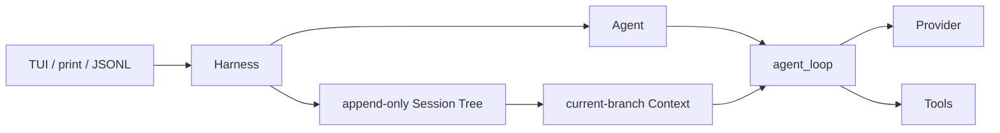

# 架构

`le-agent-ai` 把厂商协议归一化为 `UserMessage`、`AssistantMessage`、`ToolResultMessage` 和流式 `StreamEvent`。Provider 从不把网络错误抛进 loop：它产出带 `stop_reason="error"` 的终态消息，使 UI、JSONL 与持久化看到同一条生命周期。

`le-agent-core` 的 `agent_loop()` 只操作传入 `AgentContext`：先追加 prompt、请求模型、流式发送事件、验证并执行 tool call、按 tool-call 原顺序追加 tool result，再决定是否继续。`Agent` 是该 loop 的薄状态层，负责 steering、follow-up、取消和有序订阅者；`AgentHarness` 在完整 message/tool-result 边界持久化 Session。

注入点包括 `transform_context`、`convert_to_llm`、`before_tool_call`、`after_tool_call`、`prepare_next_turn` 与 `should_stop_after_turn`。这使运行时可扩展而不需要把 CLI 的策略耦合进 core。
