# LeAgent 原生 benchmark 架构：从命令到可诊断结果

LeAgent 原生 benchmark 是 `le_agent_coding` 应用层的一条串行评测管线。它复用正常的 `CodingSession`、agent loop 和 coding tools，让被测 agent 在每个 task 的临时副本中行动；benchmark 自己只负责任务加载、轨迹观察、确定性评分、指标与报告。本文只描述当前已经存在的代码，不把未来设想写成现有能力。

最小自检命令是：

```bash
uv run le-agent benchmark --provider fake
uv run le-agent benchmark --task failing_test_fix --output results/run.json
uv run le-agent benchmark --provider openai --model gpt-5 --trials 3
```

`fake` 是默认且无凭据模式；real provider 会访问外部服务并可能产生费用。可重复使用 `--task` 选择 task；`--trials` 必须为正整数；`--seed` 默认记录 `300`；`--keep-workspaces` 会在运行结束后把 trial 目录搬到结果目录供调试。Seed 当前是 artifact 元数据，不会让真实 provider 自动变成确定性系统。

## 模块边界

代码分层遵循 `AgentHarness = reusable agent brain`、`AgentSession = coding environment`、CLI/TUI 是 frontend 的原则。Benchmark 依赖 provider 选择、用户配置、工作目录、coding tools、`CodingSession` 和本地结果文件，所以属于 `le_agent_coding`；如果把 task、reward 或 Rich 报告塞进 `le_agent`，可移植 harness 就会被 LeAgent CLI 的产品策略绑住。

Benchmark 与既有层的接缝是公开 session event。Runner 不复制 agent loop，只迭代 `session.prompt()`；collector 作为消费者观察事件，不反向控制模型决策。这与 Rich print renderer 和 Textual adapter 消费同一类事件的方向一致。

### 逐文件职责

| 文件 | 当前职责 | 不负责什么 |
|---|---|---|
| [`src/le_agent_coding/benchmark/models.py`](../../src/le_agent_coding/benchmark/models.py) | 定义不可变 task、check、trajectory、trial、metrics、run 和五种状态 | 不执行任务或序列化文件 |
| [`src/le_agent_coding/benchmark/tasks.py`](../../src/le_agent_coding/benchmark/tasks.py) | 读取内置 TOML，验证 schema、workspace、timeout、重复 ID 和可信 evaluator 名称 | 不动态 import 第三方评分器 |
| [`src/le_agent_coding/benchmark/fake.py`](../../src/le_agent_coding/benchmark/fake.py) | 为三个内置 task 构造 scripted provider event 和工具调用 | 不代表模型推理能力，不直接改 fixture |
| [`src/le_agent_coding/benchmark/collector.py`](../../src/le_agent_coding/benchmark/collector.py) | 把 session event 归一化为稳定 step，并累计 final text、工具计数和 provider usage | 不评分，也不保存所有流式 partial snapshot |
| [`src/le_agent_coding/benchmark/evaluators.py`](../../src/le_agent_coding/benchmark/evaluators.py) | 从可信 registry 选择确定性 evaluator，检查最终 workspace 或 final text | 不相信 agent 自报的测试结论，也没有 LLM judge |
| [`src/le_agent_coding/benchmark/metrics.py`](../../src/le_agent_coding/benchmark/metrics.py) | 汇总状态、时长、工具错误、usage 与逐 task `pass@k` | 不改变单 trial reward |
| [`src/le_agent_coding/benchmark/runner.py`](../../src/le_agent_coding/benchmark/runner.py) | 串行编排 workspace、session、timeout、collector、evaluator 和 cleanup | 不解析 CLI，也不写 JSON |
| [`src/le_agent_coding/benchmark/reporting.py`](../../src/le_agent_coding/benchmark/reporting.py) | 把 dataclass 转成版本化 JSON，原子替换目标文件，并渲染 Rich 摘要 | 不运行模型或决定评分 |
| [`src/le_agent_coding/benchmark/__init__.py`](../../src/le_agent_coding/benchmark/__init__.py) | 暴露稳定的公共类型与 runner 入口 | 不包含业务实现 |
| [`src/le_agent_coding/cli.py`](../../src/le_agent_coding/cli.py) | 解析选项、选择 fake/real provider、预检输出目录、调用 runner、写报告并决定退出码 | 不重写 agent loop |

真正的 agent 环境由 [`src/le_agent_coding/session.py`](../../src/le_agent_coding/session.py) 的 `CodingSession` 提供，工具集合由 [`src/le_agent_coding/tools.py`](../../src/le_agent_coding/tools.py) 的 `create_coding_tools` 构造。可复用事件与 loop 仍在 `le_agent`；benchmark 没有改变那一层的 ownership。

## 从 CLI 到 JSON 的完整数据流

```mermaid
flowchart LR
    CLI["CLI：解析 provider、task、trials、output"] --> Loader["Task loader：验证内置 manifest"]
    Loader --> Runner["Runner：按 task/trial 串行编排"]
    Runner --> Copy["复制 fixture 到临时 workspace"]
    Copy --> Session["CodingSession + coding tools"]
    Session --> Events["公开 session event 流"]
    Events --> Collector["TrajectoryCollector"]
    Session --> Final["agent 正常结束"]
    Final --> Evaluator["可信 deterministic evaluator"]
    Collector --> Trial["TrialResult"]
    Evaluator --> Trial
    Trial --> Metrics["calculate_metrics"]
    Metrics --> Run["BenchmarkRun"]
    Run --> JSON["临时 JSON + 原子 replace"]
    Run --> Rich["Rich 终端摘要"]
```



具体顺序如下：

1. `src/le_agent_coding/cli.py` 只在没有请求 `--print`、`--mode` 或 `--export` 时，才把第一个位置参数 `benchmark` 识别为命令；`le-agent --print benchmark` 仍把它当 prompt，命令后的这些选项则显式报冲突。随后 CLI 解析共享的 `--provider`、`--model`、`--output` 和 benchmark 专用选项。
2. `run_benchmark_command` 调用 loader，未知 task、非法 manifest、非法 trial 数或不可写输出目录会尽量在模型调用前失败。
3. Fake 模式为每个 trial 创建独立 `FakeProvider`；real 模式沿现有 provider settings、credential store、model selection 和 shell settings 创建 provider。
4. CLI 在系统临时目录创建本次 run 的活跃根；Runner 为每个 task/trial 生成独立子目录，把 manifest 所指 `workspace/` 用 `shutil.copytree` 复制进去，再以该目录作为 `CodingSessionConfig.cwd` 创建 coding tools。
5. `session.prompt(task.prompt)` 继续走 LeAgent 正常 agent loop。每个公开 event 先交给 `TrajectoryCollector.record`，runner 只额外识别终止错误。
6. Agent 正常结束后，registry 中的 evaluator 检查最终 workspace 或 final text，返回二元 reward 和 check。异常会成为 `evaluation_failure`。
7. Runner 先构造每个 `TrialResult`，再调用 metrics 形成 `BenchmarkRun`。即使一个 trial 失败，嵌套循环仍继续后续 trial。
8. 若指定 `--keep-workspaces`，CLI 先把活跃目录搬到结果目录的 `workspaces/<run-id>/`，重建冻结的 workspace 路径；然后写 JSON 并渲染摘要。普通 `task_failed` 的 batch 退出码仍为零，因为它是有效评测数据；出现 `agent_failure`、`timeout` 或 `evaluation_failure` 时退出码为一。

### `failing_test_fix` 的逐事件例子

内置 manifest [`src/le_agent_coding/data/benchmark_tasks/failing_test_fix/task.toml`](../../src/le_agent_coding/data/benchmark_tasks/failing_test_fix/task.toml) 要求修复 `slugify` 并运行测试。其 fake 脚本仍经过真实 session 与工具。一次实际 fake run 的标准化 trajectory 按下面顺序出现：

| sequence | kind | 关键内容 | collector 的解释 |
|---:|---|---|---|
| 0 | `assistant_message` | 空文本、`is_error=false` | 模型这一回合只请求工具，完整 assistant 消息仍被记录 |
| 1 | `tool_execution_start` | `bash`，命令 `python -m unittest discover -s tests -t . -q` | 工具调用计数加一 |
| 2 | `tool_execution_end` | 输出显示 `tau---agent != tau-agent` | 命令失败是诊断证据；该工具事件本身的 `is_error` 为假 |
| 3 | `assistant_message` | 空文本 | 下一次工具回合边界 |
| 4–5 | start/end | `read slugify.py`，读到 `.split(" ")` | 参数和结果均进入 trajectory |
| 6 | `assistant_message` | 空文本 | 读取回合结束 |
| 7–8 | start/end | `edit` 把 `.split(" ")` 换为 `.split()` | 实际修改临时 workspace |
| 9 | `assistant_message` | 空文本 | 编辑回合结束 |
| 10–11 | start/end | 再跑 unittest，结果 `OK` | 形成可见验证证据 |
| 12 | `assistant_message` | 最终中文说明 | 成为 `final_text` |

随后 `_failing_test_fix` evaluator 不依赖 discover 对“零测试”的跨 Python 版本退出码。它用 `sys.executable -I -c` 启动隔离 launcher，显式把 workspace 根加入模块路径，精确加载 `tests.test_slugify.SlugifyTests.test_slugify_collapses_repeated_spaces`，并同时要求结果成功且 `testsRun == 1`；删除/清空测试文件或移除类、方法都会让 visible check 失败。另一个隔离 Python 子进程继续检查连续空格、制表符、换行、首尾空格和简单输入。Fixture 使用标准库 `unittest`，因此安装 wheel 的运行环境不依赖开发用的 pytest。Task prompt 和 fake agent 的可见命令仍可用 `python -m unittest discover -s tests -t . -q`；两项 evaluator check 都过才得到 `reward=1`。Fake 脚本的四次工具调用和固定解法证明管线连通，不证明未知模型会自主发现修复。

Collector 只保存完整 assistant 消息、工具开始与工具结束，避免每个 token delta 重复膨胀 artifact。工具结果超过 4,000 字符会截断并设置 `truncated=true`。Usage 仅在 provider 上报非零值时存在；`cache_write` 直接累计 `Usage.cache_write`，不会再次叠加 `cache_write_1h` 这类分层诊断字段。credential 不属于 event，因此不会由 collector 主动写入。

## Manifest 与 JSON schema 字段

### Manifest

| 字段 | 类型 | 含义与校验 |
|---|---|---|
| `schema_version` | integer | 当前只能等于 `1` |
| `id` | string | task 稳定标识；加载同一目录树时不可重复 |
| `title` | string | 供人阅读的标题 |
| `prompt` | string | 发给 agent 的任务；去空白后不可为空 |
| `timeout_seconds` | integer 或 float | runner deadline，必须有限且大于零 |
| `evaluator` | string | 必须出现在 `KNOWN_EVALUATORS` 可信集合中 |

每个 manifest 的同级 `workspace/` 必须存在。Loader 不接受任意 Python import、shell grader 或外部 task URL，这是一条刻意收紧的信任边界。

### 顶层 `BenchmarkRun`

| 字段 | 含义 |
|---|---|
| `schema_version` | 当前 JSON schema 版本 `1` |
| `run_id` | 随机 run 标识，用于区分目录与结果 |
| `started_at`、`finished_at` | 带 UTC offset 的 ISO 8601 时间 |
| `provider`、`model` | 实际选择的 provider/model 标签 |
| `seed` | 用户请求并记录的 seed |
| `task_ids` | 本次实际选择的 task ID 列表；顺序与 runner 的稳定执行顺序一致 |
| `requested_trials` | 每个选中 task 请求的 trial 数 |
| `git_commit` | 尽力读取的当前 commit；读取失败可为 `null` |
| `results` | 所有 task/trial 的 `TrialResult` 数组 |
| `metrics` | 整个 run 的聚合指标 |

### `TrialResult`、check 与 trajectory

| 字段组 | 字段 | 含义 |
|---|---|---|
| 身份 | `task_id`、`trial` | task 标识和从一开始的 trial 序号 |
| 结论 | `status`、`reward`、`checks` | 分类状态、零一奖励及 `{name, passed, detail}` 检查 |
| 运行 | `duration_seconds`、`tool_calls`、`tool_errors` | 端到端时长与工具计数 |
| 用量 | `usage` | 可为 `null`；存在时含 `input`、`output`、`cache_read`、`cache_write`、`reasoning`、`total_tokens` |
| 内容 | `final_text`、`trajectory` | 最终 assistant 文本和标准化步骤数组 |
| 诊断 | `error`、`workspace` | 有界错误摘要；仅保留目录时记录 workspace 路径 |

每个 `TrajectoryStep` 包含 `sequence`、`elapsed_ms`、`kind`，并按事件需要填写 `text`、`tool_name`、`tool_call_id`、`arguments`、`result`、`is_error`、`truncated`；不适用字段写 `null`。`TrajectoryStep` 不含 `usage`；单次 provider 用量单独保存在 `TrialResult.usage`。

### `BenchmarkMetrics`

| 字段 | 含义 |
|---|---|
| `task_count`、`trials` | 实际出现的不同 task 数，以及全部 task/trial 结果数 |
| `passed`、`task_failed`、`timed_out`、`infrastructure_failed` | 结论计数；基础设施失败包含后三类非正常完成状态，timeout 另列子集 |
| `success_rate` | `passed / trials`；没有结果时为零 |
| `mean_duration_seconds` | 全部 trial 的平均端到端时长 |
| `mean_duration_seconds_by_task` | 逐 task 汇总其所有 trial 的平均端到端时长，以 task ID 为键 |
| `mean_tool_calls` | 全部 trial 的平均工具调用数 |
| `tool_errors`、`tool_error_rate` | 工具错误总数，以及工具错误数除以工具调用数；没有调用时错误率为零 |
| `usage` | provider 实际上报的用量总和；全部缺失时为 `null` |
| `pass_at_k`、`macro_pass_at_k` | 逐 task 的 pass@k 与跨 task 宏平均 |

JSON 对象键只能是字符串，所以整数 `k` 落盘后表现为字符串键。`schema_version` 仍为 `1`：这些字段是在尚未发布的 native benchmark 功能分支内补齐既定 v1 设计，而不是修改已经发布的 artifact 契约。

## Fake 与 real provider

| 维度 | Fake 模式 | Real 模式 |
|---|---|---|
| Provider 来源 | benchmark 内置 scripted `FakeProvider` | LeAgent 已配置 provider 与 credential |
| 模型标签 | 固定 `benchmark-fake` | 配置默认或 `--model` 覆盖 |
| 决策来源 | task-specific 固定事件脚本 | 外部模型根据上下文生成 |
| 工具执行 | 经过真实 `CodingSession` 与 coding tools | 同样经过真实 session 与 tools |
| 网络与费用 | 不调用模型 API，无模型费用 | 可能访问网络、产生 token 费用 |
| 可重复性 | 脚本事件确定，环境仍须正常 | seed 也不能保证完全确定 |
| 结果含义 | 评测基础设施集成测试 | 给定配置在当前 task set 上的观测能力 |

Real 模式当前复用一个 runtime provider 完成串行 trials，并在结束时关闭。Benchmark 没有第二套 credential 或 provider 配置协议。Fake 满分不能和 real 分数并排称为模型排行榜成绩。

## 五种 TrialStatus

| 状态 | 来源 | reward/check 处理 | CLI 含义 |
|---|---|---|---|
| `passed` | agent 正常结束且 evaluator reward 为一 | 保存 evaluator checks，reward 一 | 有效能力数据，batch 可正常退出 |
| `task_failed` | agent 正常结束但至少一个必要 check 未过 | 保存失败 checks，reward 零 | 有效能力数据，batch 仍可退出零 |
| `agent_failure` | provider、tool dispatch、agent loop 或初始化失败；原先成功/任务失败但 cleanup 失败也归入此类 | reward 零，通常无 checks，写有界 error | 基础设施类失败，CLI 退出一 |
| `timeout` | 等待 prompt 超过 task 的 `timeout_seconds` | 先调用 `session.cancel()`，再取消 prompt child；reward 零 | 基础设施类失败，CLI 退出一 |
| `evaluation_failure` | evaluator 崩溃、无法启动子进程或自身超时 | reward 零，写 evaluator error | 测量失败而非解题失败，CLI 退出一 |

Metrics 的 `infrastructure_failed` 当前按“总 trial 减 passed 与 task_failed”计算，因此包含后三种；`timed_out` 另列 timeout 子集。不要把 infrastructure failure 解释为模型答错。

## Workspace、timeout 与原子写入

CLI 用 `mkdtemp(prefix="le-agent-benchmark-")` 在系统临时目录建立活跃根，并在 `finally` 显式清理；Runner 再创建 `<run-id>-<task-index>-<trial>` 子目录并用 `copytree` 复制原始 fixture。活跃路径不在调用者仓库下面，因此不会沿父目录继承调用者的 `.git` 或 pytest 配置；evaluator 还显式指定 fixture 的测试。每个 trial 都从新副本开始，所以前一 trial 的修改不会泄漏到下一 trial，仓库内原始 fixture 也不应被改写。启用 keep 时，CLI 会在解析 provider/model 前预检 `workspace archive 父目录` `<result-directory>/workspaces` 是目录且可以创建，避免真实模型运行后才发现结果无法归档。

默认在 `finally` 中关闭 session 并递归删除副本，临时根退出时再兜底清理。`--keep-workspaces` 不会让 agent 直接在结果目录运行：评分结束后，CLI 才把目录安全搬到 `<result-directory>/workspaces/<run-id>/`，目标已存在时拒绝覆盖，并用 `dataclasses.replace` 重建冻结的 `TrialResult.workspace` 与 `BenchmarkRun`。搬移发生在 artifact 写入前，所以 JSON 写失败时已保留目录仍可用于诊断。

Teardown 使用 `CancelScope(shield=True)`，让外部 cancellation 下的 `session.aclose()` 和 workspace 删除都得到独立执行机会；close 失败不会阻止后续删除。CLI 复用的 real runtime provider 也在 shield 中关闭；若已有 primary 异常，provider close 失败只追加诊断。若付费 run 已成功而 provider close 失败，CLI 暂存原 close error，仍先完成 keep 归档、原子 JSON 写入和 Rich 渲染；仅在 artifact 写入后把 artifact/workspace 路径追加到该异常并令 CLI exit 1。若 archive 或 artifact 写入自身失败，它们仍是 primary，close error 只作为 secondary note。已有 `timeout`、`evaluation_failure` 或 `agent_failure` 是 primary 根因，cleanup 异常只以“清理 session/workspace 失败”追加到有界 `error`，不会改写 status。原先是 `passed` 或 `task_failed` 时，cleanup 失败统一转成 `agent_failure`、清空 reward/check，并以 `CleanupError` 标记。外部 cancellation 则先显式 `session.cancel()`，完成 shield cleanup 后重抛原取消，不伪造 `TrialResult`。

Runner 用 `anyio.fail_after(task.timeout_seconds)` 包围 prompt 完成等待。Prompt child 位于 runner 可控的 shield scope；超时或外部取消时，父协程先向依赖 LeAgent cancellation token 的 provider/tool 发出 `session.cancel()`，再取消并等待 prompt child，避免 token 尚未设置时 child 已先退出。Evaluator 的 Python 或命令检查各有十秒 subprocess timeout。两类 timeout 必须区分：前者是 `timeout`，后者由 `BenchmarkEvaluationError` 转成 `evaluation_failure`。

CLI 的 `_prepare_benchmark_output` 会先在目标目录创建两个临时文件并尝试同目录 `replace`，尽量在调用模型前发现目录不可写或无法原子替换。真正写入时，reporting 使用同目录 `NamedTemporaryFile`，序列化、换行并 flush 后用 `Path.replace` 替换目标；异常则删除残留临时文件。它避免读者看见半份 JSON，但当前代码没有显式 `fsync`，所以不能把它宣称为断电级持久性保证。

## 如何新增 task

新增第 4 个可信内置 task 需要同时补齐题目、评分和 fake 管线，而不是只放一个 prompt。假设 ID 为 `fourth_task`：

1. 在 `src/le_agent_coding/data/benchmark_tasks/fourth_task/` 创建 `task.toml` 与最小 `workspace/`。Fixture 应离线、可读、没有 secret，并控制规模。
2. Manifest 写 `schema_version = 1`、唯一 `id`、中文 `title`、明确 `prompt`、正数 `timeout_seconds` 和 `evaluator = "fourth_task"`。不要声明任意 import 或 shell grader。
3. 在 `src/le_agent_coding/benchmark/tasks.py` 的 `KNOWN_EVALUATORS` 加入名称，让 loader 仍保持 allowlist。
4. 在 `src/le_agent_coding/benchmark/evaluators.py` 实现确定性函数，直接检查最终 workspace 或 final text，返回有诊断细节的 `EvaluationCheck`，再注册到 `EVALUATORS`。先写正例、反例和 evaluator failure 测试。
5. 在 `src/le_agent_coding/benchmark/fake.py` 增加只通过正常 assistant/tool-call event 行动的脚本，并同步 `_SCRIPTS` 与 `_TOOL_NAMES`。脚本不得直接修改 fixture 或绕过 `CodingSession`。
6. 扩展 task loader、evaluator、fake 和 runner 测试，验证原始 fixture 不变、临时副本独立、隐藏边界能挡住投机解法、trajectory 与状态正确。
7. 运行聚焦测试，再执行 `uv run le-agent benchmark --provider fake --task fourth_task --keep-workspaces` 检查 artifact、终端摘要和保留目录。最后运行完整质量门槛。
8. 若 task 语义、fixture 或 evaluator 改变，应更新 task set 版本或至少绑定新的 Git commit，并在文档说明新旧成绩不可直接比较。

当前 loader 只扫描包内内置目录，没有第三方 task 插件接口。新增外部动态 task、任意 evaluator import 或上传排行榜都属于新设计，不能从上述步骤推断已经支持。

## 安全边界与局限

第一，**没有真正沙箱**。系统临时目录只是运行卫生；`bash` 与文件工具仍运行在宿主权限下，绝对路径或 `..` 可访问 workspace 外。Benchmark 当前调用 `create_coding_tools()` 时也会注册 `web_search`，因此 real trial 可能访问外网并受 Tavily 配额影响。这既是安全边界，也是可复现性变量；当前 runner 没有禁用搜索的 CLI 开关，严格离线对比需要先补该配置或注入固定 Backend。只能运行仓库内可信 fixture、prompt 和 evaluator；后续应使用最小权限容器/worker，限制挂载、网络、进程和资源，并将 evaluator 置于 agent 不可见的控制面。

第二，**没有并发执行**。Runner 对 task 和 trial 使用嵌套串行循环。这让 trajectory 易读，也避免首版同时解决 rate limit，但大规模实验会很慢。后续并发必须是有界的，并按 provider 配额限流；每个 worker 仍需独立 workspace、取消传播和结果顺序标识。

第三，**task 太少且过小**。三个内置 task 只覆盖小型检索、精确编辑和局部修复，无法代表大型仓库、长时规划、多语言构建或模糊需求。后续应先增加经过评审的 task 与版本化 split，再讨论统计显著性和跨模型比较。

第四，**没有 LLM judge 与人工评审管线**。当前 deterministic evaluator 适合可执行行为，却不能可靠评价开放式设计质量或解释风格。演进时应先定义 rubric、保存 judge 模型与 prompt、用盲化人工样本校准，并把 judge disagreement 作为数据；不能简单用一个模型分数替代可执行 check。

第五，**安全与隐私过滤有限**。Collector 截断大工具输出，credential 通常不进入 event，但当前没有通用 secret scrubber。错误摘要也只是长度受限。涉及敏感仓库前，需要结构化脱敏、artifact 访问控制和保留期限。

最后，LeAgent benchmark 不是 τ²-bench adapter，也不兼容 SWE-bench。它是一套教学性、本地、可信 task 的 coding-agent benchmark。最诚实的演进顺序是：先扩充版本化 task set，再加隔离和有界并发，然后做跨模型报告；只有遇到确定性 check 无法表达的目标时，再引入经过校准的 LLM judge 或人工评审。
