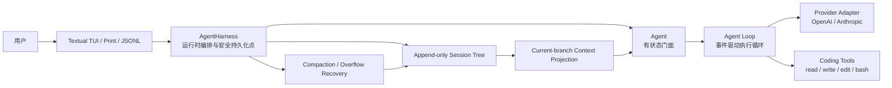
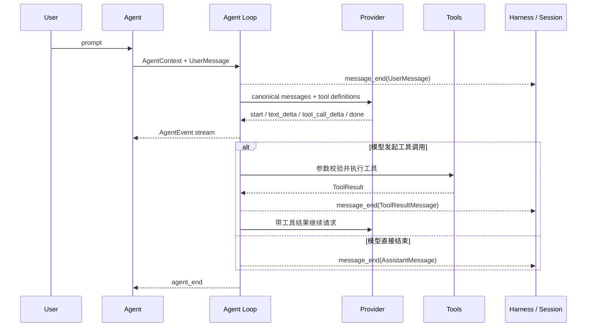
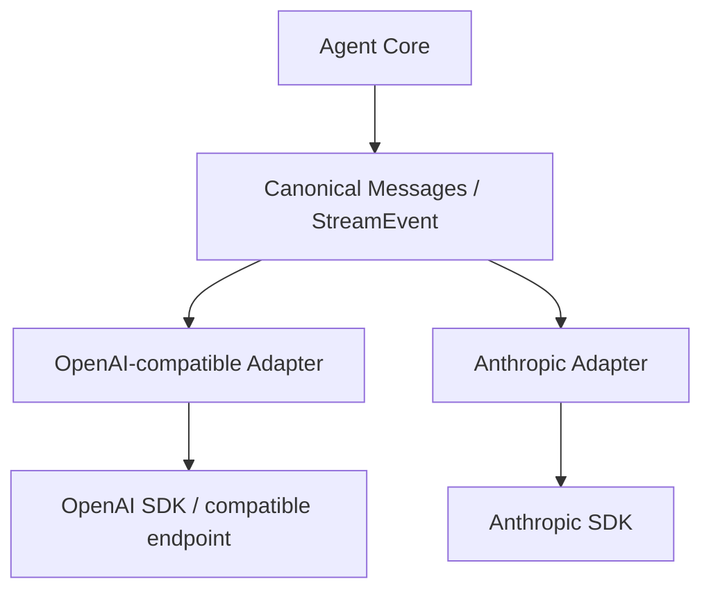
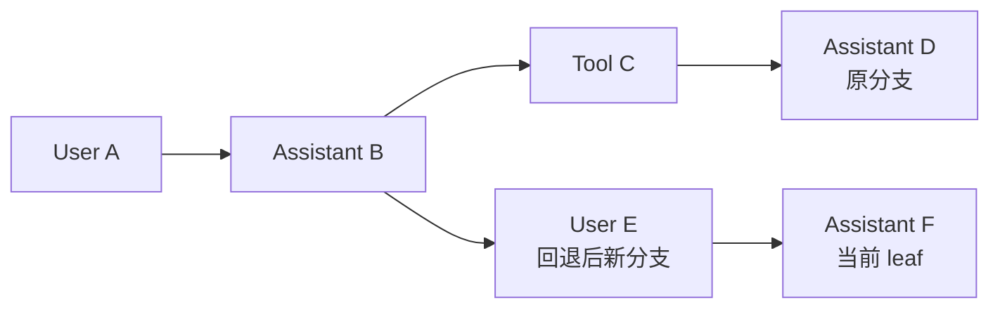
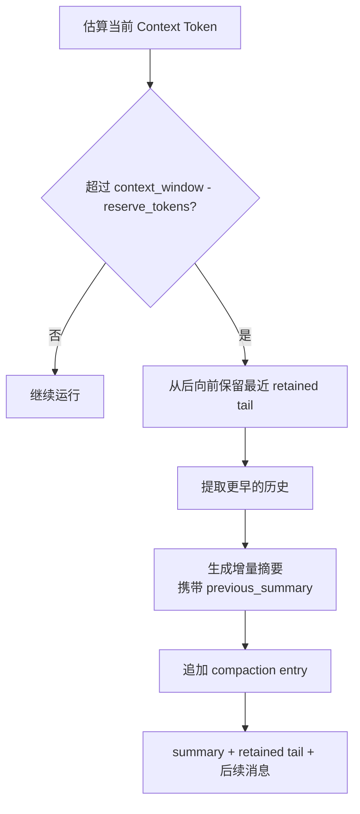

# le-agent 校招 Agent 开发简历与面试材料

## 1. 项目定位

### 推荐项目名称

**le-agent：从 0 搭建的 Python Coding Agent Runtime**

### 一句话定位

从 0 完成工程搭建与核心功能实现的轻量级 Coding Agent，覆盖模型适配、Agent Loop、工具调用、会话持久化、上下文压缩、安全权限和终端交互等完整链路。

### 项目性质与事实边界

- 项目性质：个人项目，独立完成工程设计、编码、测试与文档。
- 架构来源：参考 pi 的小型 Agent Loop、Session 与 Compaction 设计思想，以 Python 独立实现，没有复制其 TypeScript 源码。
- 推荐表述：**从 0 搭建并独立实现完整 Coding Agent 工程**。
- 不推荐表述：**从 0 发明全新的 Agent 架构**。

“从 0 搭建”强调的是从空仓库完成模块设计和工程实现，与“所有架构思想均为原创”不是一回事。面试中主动说明参考来源，反而能够体现技术调研、架构理解和落地能力。

---

## 2. 简历可直接使用的版本

### 2.1 标准版（推荐）

**le-agent｜Python Coding Agent Runtime｜个人项目**

**技术栈：** Python 3.12、AsyncIO、Pydantic、Textual、OpenAI/Anthropic SDK、Pytest、MyPy、Ruff

> 从 0 搭建轻量级终端 Coding Agent，完成模型适配、Agent 运行时、工具系统、会话树、上下文压缩与安全权限等核心模块，支持流式交互、工具调用、会话分支和断点恢复。
>
> - 采用 `AI / Core / CLI` 三包分层架构，设计统一消息模型和流式事件协议，通过 Provider Adapter 接入 OpenAI-compatible 与 Anthropic 模型，隔离不同厂商的消息、工具调用和错误协议。
> - 实现事件驱动 Agent Loop，支持流式响应、工具参数校验、并行/串行工具调度、运行中 Steering、Follow-up、取消传播和生命周期钩子，使核心运行时可脱离终端 UI 独立复用。
> - 设计 append-only JSONL Session Tree，以 `parent_id + leaf pointer` 支持会话分支、回退和恢复；按当前分支投影模型上下文，并通过增量摘要与 retained tail 实现不删除历史的 Context Compaction。
> - 实现 workspace 路径及符号链接逃逸校验、三级工具权限、Session 文件锁与异常尾行恢复；编写 116 个自动化测试，整体覆盖率 86.06%、核心包覆盖率 93%，通过 Ruff 与 strict MyPy 检查。

### 2.2 一页简历精简版

**le-agent｜从 0 搭建的 Python Coding Agent｜个人项目**

**技术栈：** Python、AsyncIO、Pydantic、Textual、OpenAI/Anthropic SDK、Pytest

- 设计 `AI / Core / CLI` 分层架构及统一消息、流式事件协议，适配 OpenAI-compatible 与 Anthropic，独立实现支持流式输出和 Tool Calling 的 Agent Loop。
- 基于 append-only JSONL 构建可分支 Session Tree，支持会话回退、恢复、当前分支上下文投影及增量摘要式 Context Compaction。
- 实现工具并行/串行调度、运行中 Steering、权限审批、路径逃逸防护与故障恢复；116 个测试全部通过，核心包覆盖率 93%。

### 2.3 极简版（一条项目经历空间）

> 从 0 搭建 Python Coding Agent Runtime，自主实现多模型流式适配、Agent Loop、Tool Calling、append-only Session Tree、Context Compaction 与工具权限控制；项目包含 116 个自动化测试，核心模块覆盖率 93%。

---

## 3. 为什么这个项目适合校招 Agent 开发岗位

该项目可以证明的不是“会调用大模型 API”，而是以下四类能力：

1. **Agent 运行机制理解**：理解模型消息、流式事件、工具调用、循环终止、上下文管理和错误终态之间的关系。
2. **系统设计能力**：能够划分 Provider、Loop、State、Persistence、UI 和 Permission 等边界，避免将所有逻辑堆在单个脚本中。
3. **异步与状态管理能力**：能够处理流式消费、并发工具、取消传播、运行中插入消息和会话恢复。
4. **工程质量意识**：有类型约束、测试覆盖、静态检查、安全边界、文件锁、异常恢复和明确的设计文档。

面试时应该始终围绕一个中心展开：

> 我实现的是一个小型但链路完整的 Agent Runtime，而不是单轮 Chat Completion Demo。

---

## 4. 总体架构设计

### 4.1 分层架构

### 4.2 三个包的职责

| 包 | 核心职责 | 设计价值 |
| --- | --- | --- |
| `le-agent-ai` | 统一消息模型、流式事件、模型注册、OpenAI/Anthropic Provider | 隔离厂商协议，向 Core 提供稳定接口 |
| `le-agent-core` | Agent Loop、AgentState、Session Tree、Context 投影、Compaction、Harness | 承载可复用的 Agent Runtime 语义 |
| `le-agent-cli` | Coding Tools、权限控制、Skills、配置、命令系统、Textual TUI | 负责产品交互和本地执行策略 |

### 4.3 核心设计原则

- **协议与策略分离**：Provider 处理厂商协议，Loop 只处理统一消息和事件。
- **无状态内核与有状态门面分离**：`agent_loop()` 只操作传入 Context，`Agent` 管理运行态与控制指令。
- **持久态与运行态分离**：Session 是持久化真源，AgentState 可以从当前分支重新构建。
- **历史存储与模型上下文分离**：Session 保存完整历史，Context 仅投影当前分支及必要摘要。
- **安全策略通过钩子注入**：工具权限由 `before_tool_call` 控制，不写死在 Agent Loop 中。

---

## 5. Agent Loop 设计

### 5.1 一次完整请求的数据流

### 5.2 关键实现点

#### 统一事件生命周期

Agent Loop 对外发送 `agent_start`、`turn_start`、`assistant_request_start`、`message_update`、`tool_execution_start`、`tool_execution_end`、`agent_end` 等事件。TUI、JSONL 输出和持久化层消费同一套事件，从而避免不同出口各自维护一套运行状态。

#### 工具调用调度

- 默认可使用 `asyncio.gather` 并发执行互不影响的工具。
- `write`、`edit`、`bash` 等有副作用的工具声明为 sequential，避免修改顺序不确定。
- 即使工具并发完成，结果仍按照原始 tool call 顺序写回 Context，保证模型历史确定性。
- 工具参数先经过 Pydantic Schema 校验；未知工具、参数错误和执行异常统一转换为错误 ToolResult，不直接破坏循环。

#### 运行中控制

- `Steering`：Agent 正在运行时接收用户新指令，并在下一轮请求前注入。
- `Follow-up`：当前 Agent Loop 正常结束后继续消费排队消息。
- `Abort`：取消活动 Task，并向 Provider stream 传播取消信号。

#### 扩展钩子

运行时提供 `transform_context`、`convert_to_llm`、`before_tool_call`、`after_tool_call`、`prepare_next_turn` 和 `should_stop_after_turn` 等注入点。这样可以增加权限、上下文转换或停止策略，而无需修改 Loop 主流程。

---

## 6. 多模型 Provider 设计

### 6.1 为什么需要 Provider Adapter

OpenAI 和 Anthropic 在消息结构、工具定义、流式事件及 Token Usage 上存在差异。如果业务层直接处理两套 SDK，Agent Loop 会出现大量厂商条件分支。因此项目先定义 canonical messages 和 `StreamEvent`，再由 Provider 完成双向转换。

### 6.2 错误为什么也要协议化

Provider 不把普通网络、鉴权或限流异常直接抛入 Agent Loop，而是转换成带 `stop_reason="error"` 和标准化 `error_code` 的终态 AssistantMessage。这样有三个好处：

1. TUI 能稳定显示错误，不需要理解 SDK 异常类型。
2. JSONL 输出与 Session 持久化看到一致的生命周期。
3. Harness 可以识别 `context_overflow` 并执行压缩后恢复。

取消属于单独终态 `aborted`，用于区分用户主动中止和请求失败。

---

## 7. Session Tree 与上下文投影

### 7.1 为什么不是普通 messages 数组

线性 messages 数组适合简单聊天，但难以同时支持回退、分支、审计与恢复。本项目将每个 Session 存储为 append-only JSONL：

- 每条 entry 有唯一 `id` 和 `parent_id`。
- 新记录默认指向当前 leaf，形成一条分支。
- 切换节点只改变内存中的当前指针；后续新增 entry 会从目标节点产生新分支。
- 旧记录不被覆盖或删除，因此可以恢复任意历史路径。

### 7.2 Session 与 AgentState 的关系

> Session 是持久化真源，AgentState 是当前分支的可重建运行态。

恢复或切换分支时，系统从当前 leaf 沿 `parent_id` 回溯到根节点，反转得到当前分支，再投影其中的 message、branch summary 和 compaction 信息，重新构建 AgentState。

这种设计避免了 UI、磁盘记录和模型 Context 各自维护一套分支状态。

### 7.3 安全持久化点

Harness 只在完整 `message_end` 边界追加消息。未完成的工具调用或半截流式文本不会被当成完整历史恢复，从而避免继续执行时出现没有对应 ToolResult 的残缺 Tool Call。

文件写入后执行 flush 与 fsync；同一 Session 使用非阻塞文件锁，防止多个进程同时写入。加载 JSONL 时可忽略崩溃造成的最后一条不完整 JSON，同时保留此前完整 entry。

---

## 8. Context Compaction 设计

### 8.1 目标

模型上下文窗口有限，但直接删除早期消息会破坏 Session 的完整性。项目将“持久历史”和“发送给模型的 Context”分离：Compaction 只影响 Context 投影，不删除磁盘历史。

### 8.2 压缩流程

默认预留 16,384 tokens，并尽量保留最近 20,000 tokens。摘要器会收到上一次摘要，从而进行增量总结，减少多次压缩后关键事实丢失。

### 8.3 Context Overflow 恢复

如果 Provider 返回 `context_overflow`：

1. Harness 找到失败 AssistantMessage 对应的 Session entry。
2. 将 leaf 暂时移动到失败消息之前。
3. 对之前的 Context 执行 Compaction。
4. 从压缩后的 Context 重建 AgentState。
5. 使用 `continue_run()` 重试请求。
6. 任一步骤失败则回滚 leaf，避免破坏原 Session 状态。

这一链路体现了错误协议、Session Tree、Compaction 和 AgentState 重建之间的协作关系。

---

## 9. 工具与安全边界

### 9.1 内置 Coding Tools

| 工具 | 作用 | 执行特点 |
| --- | --- | --- |
| `read` | 读取 workspace 或已发现 Skill 目录内文本 | 可并行、带行号和长度限制 |
| `write` | 创建或覆盖 workspace 内文件 | 串行、有副作用 |
| `edit` | 精确替换旧文本 | 多匹配时要求显式 `replace_all` |
| `bash` | 在 workspace 中执行命令 | 串行、超时、输出截断并可保存完整日志 |

### 9.2 路径安全

路径检查不是简单判断字符串是否以 workspace 开头，而是先执行 `Path.resolve()`，再验证解析后的路径是否位于允许根目录内。因此可以阻止：

- 使用 `../` 离开 workspace。
- 通过 workspace 内符号链接访问外部文件。
- write/edit 使用绝对路径绕过根目录限制。

### 9.3 权限模式

- `readonly`：只允许读取，拦截 write、edit 和 bash。
- `confirm`：副作用工具需要用户审批，可单次允许或允许本 Session 编辑。
- `trust`：自动放行工具调用。

### 9.4 必须诚实说明的边界

当前安全能力属于应用层权限与路径约束，`bash` 仍然运行在本机子进程中，不是容器或操作系统级沙箱。面试时将其作为后续改进方向，比直接宣称“安全沙箱”更准确。

---

## 10. 终端交互层

Textual TUI 不是项目最核心的简历亮点，但能够证明 Agent Runtime 已经形成可用产品闭环：

- 流式 transcript 与内联工具结果。
- 请求等待态、错误反馈与 Escape 中止。
- 工具审批弹窗与权限模式切换。
- `/new`、`/resume`、`/tree`、`/compact`、`/model` 等命令。
- 会话树导航、分支切换和 Context 重绘。
- print、JSONL 与全屏 TUI 三种输出方式。

面向 Agent 开发岗位，应先讲 Core；面试官关注产品体验时，再用 TUI 说明系统不是停留在库或 Demo 阶段。

---

## 11. 工程化关键点

### 11.1 类型与数据约束

- 使用 Pydantic 定义消息、工具参数和配置模型。
- MyPy 开启 strict 模式，减少跨包接口和异步返回值的不确定性。
- Ruff 启用基础错误、import、bugbear 和 async 规则。

### 11.2 测试策略

项目当前包含 116 个自动化测试：

- Provider 消息转换、流式事件、错误归一化。
- Agent Loop、Steering、Follow-up、取消和工具执行。
- Session 分支、树投影、文件锁、尾行恢复。
- Compaction、Context Overflow 恢复及失败回滚。
- 工具路径安全、权限模式、命令系统和 TUI 状态。

当前验证结果：

- 116 tests passed。
- 整体覆盖率 86.06%。
- `le-agent-core` 覆盖率 93%。
- Ruff 检查通过。
- strict MyPy 检查通过。

### 11.3 可测试性设计

项目提供无需 API Key 的 `FauxProvider`，通过脚本化响应测试多轮模型输出和工具调用，CI 不需要请求真实付费模型。Provider、Summarizer、Tool 与生命周期策略均通过接口或回调注入，便于进行确定性单元测试。

---

## 12. 面试介绍话术

### 12.1 30 秒版本

> le-agent 是我从 0 搭建并独立实现的 Python Coding Agent。项目分成模型协议、Agent Runtime 和终端交互三层，支持 OpenAI-compatible 与 Anthropic、流式输出、工具调用以及运行中的 Steering。会话层使用 append-only Session Tree，因此可以进行分支、回退和恢复；上下文过长时通过增量摘要和 retained tail 压缩当前分支，同时保留完整历史。项目目前有 116 个自动化测试，核心模块覆盖率 93%。

### 12.2 90 秒版本

> 我做这个项目的目标，是从底层理解一个 Coding Agent 在模型调用之外还需要哪些运行时能力，所以没有直接使用 LangChain 封装，而是从空仓库完成了模块设计和实现。
>
> 整体分为三层：AI 层把 OpenAI 和 Anthropic 的消息、工具调用和流式事件转换成统一协议；Core 层实现 Agent Loop、运行中控制、Session Tree 和 Context Compaction；CLI 层提供四个 Coding Tools、权限审批和 Textual TUI。
>
> 我认为最有价值的设计是 Session。它不是普通 messages 数组，而是 append-only JSONL Tree。每条 entry 通过 parent_id 指向父节点，所以回退后可以产生新分支，旧历史不会被覆盖。发送给模型的 Context 只投影当前分支；接近窗口上限时追加一条 compaction 记录，用摘要加最近消息重建 Context，而不是删除历史。
>
> 工程上还处理了工具并发与结果顺序、取消传播、路径和符号链接逃逸、Session 文件锁、异常尾行恢复及 context overflow 自动恢复。目前 116 个测试全部通过，Core 覆盖率 93%。

### 12.3 “从 0 搭建”追问回答

> 从 0 指的是我从空仓库完成 Python workspace、三个包的职责划分、统一消息和事件协议、Agent Loop、Session 持久化、Compaction、工具系统、TUI 与测试体系。架构思想参考过 pi，我阅读并理解它的设计边界后用 Python 独立实现，没有复制 TypeScript 源码。这个过程让我真正理解了 Agent Loop 和 Session 语义，而不只是调用框架 API。

---

## 13. 高频技术追问与回答要点

### Q1：Agent Loop 不就是一个 while 循环吗？

循环本身不复杂，难点在状态和边界：流式 AssistantMessage 何时完整、多个 Tool Call 如何调度、ToolResult 以什么顺序回填、执行中如何插入 Steering、取消如何传到 Provider、错误是否写入 Session、什么时候安全持久化。项目通过统一事件生命周期和 Harness 分离这些职责。

### Q2：为什么不直接使用 LangChain 或 LangGraph？

项目目标是学习并展示 Agent Runtime 的底层机制，因此选择直接实现核心循环和持久化语义。优点是链路透明、依赖轻、错误和 Context 行为可控；代价是缺少成熟框架的生态集成。实际业务中会根据交付速度、可观测性和定制需求决定是否使用框架。

### Q3：为什么用 append-only Session？

它天然适合审计、恢复和分支：旧记录不可变，崩溃后只需忽略最后一条残缺记录，切换分支也不需要复制或删除历史。代价是文件会持续增长，后续需要归档、索引或垃圾回收策略。

### Q4：工具并发后如何保证结果顺序？

无副作用工具可以并行执行，但 `asyncio.gather` 返回结果时保持传入协程的顺序，因此 ToolResult 仍按模型原始 Tool Call 顺序写回。write、edit 和 bash 标记为 sequential，降低副作用之间的竞态。

### Q5：Compaction 为什么不会丢失历史？

因为它不修改或删除旧 entry，只追加 summary、first kept entry、retained tail 和压缩前 Token 估算。磁盘 Session 仍包含完整历史；只有构建模型 Context 时使用摘要替代较早消息。

### Q6：Token 是怎么估算的？

优先使用最近一条有效 AssistantMessage 中 Provider 返回的 Usage，再对其后的消息做保守字符估算；如果没有 Usage，则对整个 Context 估算。该方案不如模型专用 tokenizer 精确，但没有额外 tokenizer 依赖，并且足以用于提前触发 Compaction。未来可针对不同模型接入精确 tokenizer。

### Q7：如何处理模型上下文超限？

Provider 将其归一化为 `context_overflow`。Harness 回退到失败消息之前，执行 Compaction，重建 AgentState 后继续运行；如果压缩或重试失败，则恢复原 leaf，保证 Session 状态不被破坏。

### Q8：当前项目最大的安全风险是什么？

bash 仍然是本机 shell 子进程。虽然有权限确认、工作目录、超时和输出限制，但 trust 模式下没有 OS 级隔离。下一步应使用容器、受限用户或 macOS sandbox，并加入 CPU、内存、网络和文件系统限制。

### Q9：你认为最难的模块是什么？

推荐回答 Session Tree 与 Context 一致性。切换分支后，磁盘 leaf、AgentState、TUI transcript 和下一次模型请求必须指向同一条分支。项目将 Session 设为真源，切换后丢弃旧 Agent 实例并从当前分支重建，从结构上避免多份状态逐步漂移。

### Q10：如果继续迭代，你会做什么？

优先级建议如下：

1. 为 bash 增加 OS/容器级沙箱和资源限制。
2. 增加模型耗时、首 Token 延迟、Token 消耗和工具耗时观测。
3. 为大型 Session 增加索引、归档和压缩策略。
4. 增加可插拔 MCP Tool/Resource 接入，但保持 Core 不依赖具体协议。
5. 增加真实模型的显式 smoke test 和故障注入测试。

---

## 14. 项目亮点的 STAR 组织方式

### 亮点一：统一多模型协议

- **S**：OpenAI 与 Anthropic 的消息、流式事件和 Tool Call 协议不同。
- **T**：让 Agent Core 不感知具体厂商。
- **A**：设计 canonical messages、StreamEvent 和 Provider 接口，在 Adapter 中完成消息及错误转换。
- **R**：同一个 Agent Loop 可以切换不同 Provider，TUI、JSONL 和 Session 复用统一事件生命周期。

### 亮点二：可分支 Session 与 Context 管理

- **S**：线性聊天历史无法自然支持回退、分支和长上下文。
- **T**：同时保证历史完整、分支可恢复和模型 Context 可控。
- **A**：设计 append-only Session Tree、当前分支投影和增量摘要式 Compaction。
- **R**：实现不改写历史的分支导航、恢复和 Context 压缩，并能在 overflow 后自动重试。

### 亮点三：工具安全与可靠执行

- **S**：Coding Agent 需要读写文件和执行命令，存在越权、竞态和中断风险。
- **T**：建立明确的应用层安全边界和可恢复执行语义。
- **A**：实现路径解析及 symlink 校验、三级权限、工具顺序控制、超时、文件锁和完整消息持久化点。
- **R**：覆盖路径逃逸、权限拒绝、异常尾行、取消和失败回滚等边界测试。

---

## 15. 表述红线

### 可以写

- 从 0 搭建并独立实现完整 Coding Agent 工程。
- 自主实现 Agent Loop、Session Tree、Context Compaction 和 Provider Adapter。
- 参考 pi 架构思想并完成 Python 独立实现。
- 116 个测试、整体覆盖率 86.06%、Core 覆盖率 93%。

### 当前不建议写

- “生产级 Agent 平台”或“服务大量用户”。
- “完全原创 Agent 架构”。
- 已支持 Multi-Agent、MCP、RAG、向量记忆或跨会话用户画像。
- “安全沙箱”——目前更准确的是应用层权限和路径安全控制。
- 未经测量的性能提升、成本降低或延迟数字。

---

## 16. 投递和面试使用建议

### 简历筛选阶段

- 项目描述控制在 4 条，每条尽量先写动作，再写机制与结果。
- 将 `Agent Loop`、`Tool Calling`、`Context Compaction`、`Provider Adapter`、`AsyncIO` 等岗位关键词自然放入描述。
- 不把 TUI 放在第一亮点，避免项目被理解成界面开发。
- 附 GitHub 地址时，确保 README 的快速启动、架构图和测试命令可用。

### 一面

优先讲 Agent Loop 和 Session Tree，证明你理解 Agent 的核心运行机制。准备手画总体架构图和一次 Tool Calling 时序图。

### 二面或交叉面

重点讲设计取舍：为什么 append-only、为什么 Provider 错误数据化、为什么持久态和运行态分离、当前 bash 安全边界在哪里。

### HR 面

可以用下面的非技术版总结：

> 我希望系统学习 Agent 工程，所以独立完成了一个从模型接入到终端交互的 Coding Agent。这个项目不只实现了功能，也补齐了会话恢复、上下文超限、安全审批和自动化测试，让我对如何把大模型能力做成可靠软件有了完整认识。

---

## 17. 项目证据索引

- 项目入口与使用说明：[README](../README.md)
- 总体架构：[architecture.md](architecture.md)
- Session 与 Compaction：[memory.md](memory.md)
- 工具和安全边界：[safety.md](safety.md)
- Core SDK：[sdk.md](sdk.md)
- Agent Loop：`packages/le-agent-core/src/le_agent_core/loop.py`
- Session Tree：`packages/le-agent-core/src/le_agent_core/session.py`
- Compaction：`packages/le-agent-core/src/le_agent_core/compaction.py`
- Provider Adapter：`packages/le-agent-ai/src/le_agent_ai/providers.py`
- 工具系统：`packages/le-agent-cli/src/le_agent_cli/tools.py`
- 权限控制：`packages/le-agent-cli/src/le_agent_cli/permissions.py`

---

## 18. 最终记忆点

面试官离开时，最好能记住这三个关键词：

1. **从 0 搭建 Agent Runtime**：不是只做 API 封装。
2. **Session Tree + Context Compaction**：有明确的状态与长上下文设计。
3. **工程闭环**：多模型、工具安全、故障恢复、116 个测试和严格类型检查。

最终一句话：

> 我从 0 搭建了一个链路完整的 Python Coding Agent，并重点解决了 Agent Loop、多模型流式协议、会话分支、长上下文压缩和工具安全等运行时问题。
