# LeAgent 中文架构与源码学习指南

> 本文面向希望通过 LeAgent 学习 coding agent 工作原理的读者。它不是 API 手册，而是一张
> “从哪里开始读、数据如何流动、为什么要这样分层”的源码地图。

## 1. 先建立全局认识

LeAgent 是一个受 [Pi](https://github.com/badlogic/pi-mono) 启发的 Python coding agent。
它既是可以在终端中使用的工具，也是一个刻意保持可读性的教学项目。

普通聊天程序大致只做一次模型请求：

```text
用户消息 → 模型 → 助手文本
```

Coding agent 多了一个关键循环：模型可以请求工具，程序执行工具，把结果作为新消息交还
模型，模型再决定下一步。

```text
用户消息 → 模型 → 工具调用 → 本地执行 → 工具结果 → 模型 → 最终回答
```

因此，agent 的核心并不是提示词，也不是 TUI，而是一个能协调以下对象的循环：

- 可重放的消息历史；
- 供应商无关的模型流；
- 带 JSON Schema 的本地工具；
- 描述执行过程的事件；
- 取消、错误与终止条件。

LeAgent 最值得学习的设计判断是：把这颗“可复用的大脑”与 coding 应用环境、终端界面分开。

```text
AgentHarness = 可复用的有状态 Agent 大脑
CodingSession = 文件、配置、资源和持久化组成的 coding 环境
TUI = CodingSession 的一种前端
```

当前能力与运行方式以仓库根目录的 [`README.md`](../README.md)、源码和测试为准。

## 2. 三层架构与依赖方向

### 2.1 组件视图

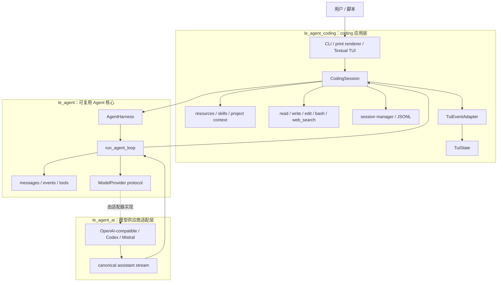

项目通常把概念方向简写成：

```text
le_agent_coding → le_agent → le_agent_ai
```

这表示一次请求从应用层进入 Agent 核心，再调用模型适配层。阅读 Python import 时会看到一个
值得注意的“依赖倒置”：`ModelProvider` 协议实际定义在
[`le_agent/provider.py`](../src/le_agent/provider.py)，具体 Provider 在 `le_agent_ai` 中实现这个协议。
这样 `le_agent` 不必导入任何具体供应商，FakeProvider 或其他实现也能直接替换进来。

### 2.2 每层只回答一个问题

| 层 | 核心问题 | 应该知道 | 不应该知道 |
| --- | --- | --- | --- |
| `le_agent_ai` | 如何与不同模型 API 流式通信？ | HTTP、SSE、供应商 payload、重试、usage | CLI 参数、会话路径、Textual widget |
| `le_agent` | 如何让模型、工具和消息形成 Agent 循环？ | 消息、工具协议、事件、循环、Harness | LeAgent home、Rich、项目资源发现 |
| `le_agent_coding` | 如何把通用 Agent 变成 coding 应用？ | cwd、文件工具、配置、技能、命令、持久化、前端 | 供应商原始 SSE chunk 的细节 |

判断一段新功能放在哪里，可以问：

1. 换成非 coding 场景还成立吗？成立则更靠近 `le_agent`。
2. 换一个模型供应商后仍然相同吗？不同则更靠近 `le_agent_ai`。
3. 只与 LeAgent 的命令、路径、资源或 UI 有关吗？是则属于 `le_agent_coding`。

## 3. 核心数据模型

### 3.1 Message：可重放的事实

消息定义在 [`le_agent/messages.py`](../src/le_agent/messages.py)。主要类型是：

- `UserMessage`：用户输入，可包含文本或图片；
- `AssistantMessage`：模型输出；
- `ToolResultMessage`：本地工具执行结果；
- `CustomMessage`：扩展或应用附带显示元数据的输入；
- `CompactionSummaryMessage` / `BranchSummaryMessage`：上下文重建所需的摘要语义。

`AssistantMessage.content` 不是单一字符串，而是有序内容块：

```text
TextContent | ThinkingContent | ToolCall
```

所有 wire model 都继承 `WireModel`。Python 内使用 `snake_case`，序列化时使用 Pi 兼容的
`camelCase`。`extra="forbid"` 使协议保持严格，避免静默吞掉拼错的字段。

### 3.2 Tool：模型可见描述与本地执行器

工具协议位于 [`le_agent/tools.py`](../src/le_agent/tools.py)。`AgentTool` 同时装着两类信息：

- 给模型看的：`name`、`description`、`parameters`；
- 给运行时用的：`execute_fn`、取消信号、进度回调；
- 可选的应用能力：prompt snippet、guidelines、renderer。

核心循环只关心 `AgentTool.execute()` 和 `AgentToolResult`，不知道文件工具或 shell 工具如何实现。
真实 coding 工具由 [`le_agent_coding/tools.py`](../src/le_agent_coding/tools.py) 创建，并绑定 cwd、参数校验、
输出截断、diff 元数据等应用策略。默认集合还包含由
[`le_agent_coding/web_search.py`](../src/le_agent_coding/web_search.py) 实现的 `web_search`。

### 3.3 三层事件：过程，而不是历史

消息和事件的职责不同：

- 消息是可以保存、重放的对话事实；
- 事件是运行中发生的过程通知。

LeAgent 有三层事件：

| 层级 | 定义 | 示例 | 消费者 |
| --- | --- | --- | --- |
| 助手流事件 | [`provider_events.py`](../src/le_agent/provider_events.py) | `text_delta`、`toolcall_end`、`done` | Agent Loop |
| Agent 事件 | [`events.py`](../src/le_agent/events.py) | `turn_start`、`message_end`、`tool_execution_end` | Harness、CodingSession、前端 |
| CodingSession 事件 | [`le_agent_coding/events.py`](../src/le_agent_coding/events.py) | `queue_update`、`compaction_end`、`agent_settled` | CLI/TUI/扩展 |

Provider 的原始解析器还会产生私有 `ProviderEvent`。它们在
[`le_agent_ai/stream.py`](../src/le_agent_ai/stream.py) 中被规范化为公开的助手流事件，不应泄漏到上层。

可以用一句话区分它们：

```text
助手流事件：模型正在生成什么
AgentEvent：Agent 这一轮正在做什么
CodingSessionEvent：应用会话还在编排什么
```

## 4. 一次请求如何跑完整个系统

下面是一条包含 `read` 工具调用的典型路径。图中的箭头基本都能在同名函数中找到。

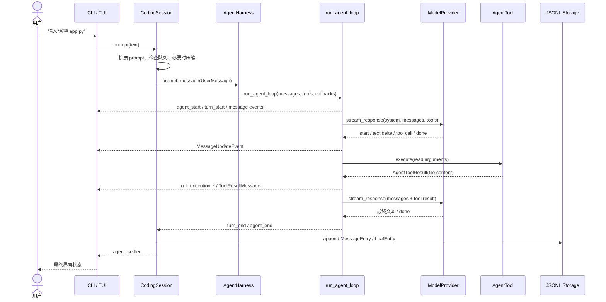

### 4.1 CLI 选择前端

入口是 [`le_agent_coding/cli.py`](../src/le_agent_coding/cli.py) 的 `main()`：

- `le-agent --print ...` 进入 `run_openai_print_mode()` / `run_print_mode()`；
- 无 `--print` 时进入 `run_openai_tui()`；
- 两条路径都会加载 `CodingSession`，区别主要是由 renderer 还是 Textual app 消费事件。

这正是“UI 是可替换消费者”的体现。业务逻辑不应该因为前端不同而复制一份。

### 4.2 CodingSession 准备 coding 环境

[`CodingSession.load()`](../src/le_agent_coding/session.py) 完成应用层装配：

- 发现 skills、prompt templates、项目说明和扩展；
- 创建并绑定 `read`、`write`、`edit`、`bash`、`web_search`；
- 组装 system prompt；
- 从存储恢复消息、模型、thinking level 和活动分支；
- 构建 `AgentHarnessConfig` 和 `AgentHarness`。

`CodingSession.prompt()` 在真正启动 Agent 前还会：

1. 运行扩展的 input hook；
2. 展开 `/skill:name`、prompt template 和文件引用；
3. 若 Agent 正在运行，将消息放入 steering/follow-up 队列；
4. 更新模型上下文限制，并按阈值尝试自动压缩；
5. 记录持久化起点，然后调用 Harness。

### 4.3 Harness 管理有状态运行

[`AgentHarness`](../src/le_agent/harness.py) 拥有 transcript，也就是 `_messages`。
它在纯函数式 Loop 外面增加四项能力：

- `prompt()` 与 `continue_()`；
- 同一 Harness 同时只能有一个 run；
- cancellation token；
- steering 与 follow-up 队列。

Harness 不做文件持久化。它只是长期持有内存消息，并把配置、消息列表和回调交给
`run_agent_loop()`。

### 4.4 Agent Loop 驱动模型和工具

[`run_agent_loop()`](../src/le_agent/loop.py) 的职责很小但很关键：

1. 把新 prompt 追加到 transcript；
2. 调 Provider 得到一个完整助手消息；
3. 如果消息带工具调用，按 batch 策略执行并追加 `ToolResultMessage`；
4. 用更新后的 transcript 再调 Provider；
5. 直到没有工具调用，再处理 follow-up 或结束 run。

Provider 出错或取消时，Loop 仍然生成一个 `AssistantMessage`，其 `stop_reason` 为 `error` 或
`aborted`。这样错误也能进入统一的消息、事件和诊断通路。

### 4.5 Provider 把供应商差异压平

`ModelProvider.stream_response()` 的参数只有 model、system、messages、tools 和 cancellation
signal。上层不传 HTTP header、SSE parser 或供应商专属 payload。

以 [`OpenAICompatibleProvider`](../src/le_agent_ai/openai_compatible.py) 为例：

1. 根据模型选择 Chat Completions 或 Responses API；
2. 把 LeAgent 消息和工具转换为供应商 payload；
3. 解析 HTTP/SSE、处理取消与重试；
4. 先生成私有 `ProviderEvent`；
5. `canonicalize_provider_stream()` 组装有序 content blocks；
6. 对外只暴露统一的 `AssistantMessageEvent`。

### 4.6 CodingSession 持久化并宣告 settled

CodingSession 在收到 `MessageEndEvent` 时增量追加新消息，避免等到整次运行结束才保存。
收到 Harness 的 `AgentEndEvent` 时，它会发出 `SessionAgentEndEvent`，但这还不一定是 UI
应该停止 loading 的时刻，因为后面可能发生：

- 上下文溢出后的自动压缩与重试；
- 阈值自动压缩；
- 已排队消息的继续处理。

只有 `AgentSettledEvent` 表示应用层编排已经真正安定。TUI 正是以 `agent_settled` 退出 running
状态。

## 5. Agent Loop：LeAgent 的最小引擎

理解 [`le_agent/loop.py`](../src/le_agent/loop.py) 时，可以把它看成两层循环。

### 5.1 内层：模型—工具回合

```text
while 还有工具调用或 steering 消息:
    发送 transcript 给模型
    收集最终 AssistantMessage
    执行其中所有 ToolCall
    把 ToolResultMessage 追加回 transcript
```

工具结果必须成为消息，而不能只在 UI 中打印。否则模型下一轮看不到文件内容或命令输出。

### 5.2 外层：整个 Agent run

```text
while True:
    跑完内层工具回合
    如果有 follow-up，把它变成下一轮 pending
    否则结束
```

`steering` 与 `follow_up` 的差异：

- steering 尽快插入正在进行的 run，在一个工具回合结束后交给模型；
- follow-up 等 run 原本要结束时再开启下一轮。

### 5.3 事件为何有 message start/update/end

流式 UI 需要 delta 才能及时显示，但持久化需要最终权威消息。因此：

- `MessageStartEvent` 创建临时显示状态；
- `MessageUpdateEvent` 携带嵌套的 text/thinking/tool-call delta；
- `MessageEndEvent` 携带最终 `AssistantMessage`，决定内容块顺序、usage 和 stop reason。

如果只保存 delta，恢复时必须重新猜测块边界；如果只发最终消息，UI 又失去流式体验。LeAgent 同时保留
两者，但明确最终消息优先。

## 6. Harness 与 CodingSession 为什么都需要

这两个类型看起来都“有状态”，但状态的层级不同。

| 能力 | `AgentHarness` | `CodingSession` |
| --- | --- | --- |
| transcript 内存所有权 | 是 | 通过 Harness 使用 |
| 模型—工具循环 | 调用 `run_agent_loop` | 不重新实现 |
| cancellation / queue | 是 | 暴露并增加应用事件 |
| skills / prompts / AGENTS.md | 否 | 是 |
| JSONL / resume / branch | 否 | 是 |
| context compaction | 否 | 是 |
| slash commands / extensions | 否 | 是 |
| Textual / renderer | 否 | 仍不直接渲染，只发事件 |

这种边界让你可以在别的应用中只复用 Harness，也可以复用完整 CodingSession 构建不同前端。

## 7. 工具系统

### 7.1 从 ToolDefinition 到 AgentTool

`le_agent_coding.tools.ToolDefinition` 是 coding 应用的构建形态。它包含：

- 参数模型与 JSON schema；
- 工作目录和路径规则；
- prompt snippet 与 guidelines；
- 调用和结果 renderer；
- 真正的异步 executor。

`to_agent_tool()` 把它收敛为核心层认识的 `AgentTool`。这一步相当于适配器边界。

### 7.2 工具调用生命周期

Agent Loop 对每个 `ToolCall` 依次发出：

```text
ToolExecutionStartEvent
ToolExecutionUpdateEvent（可选，可多次）
ToolExecutionEndEvent
MessageStartEvent(ToolResultMessage)
MessageEndEvent(ToolResultMessage)
```

`before_tool_call` 可以阻止执行，`after_tool_call` 可以审查或改写结果。这些 seam 使扩展和权限策略
无需侵入工具本身。

### 7.3 为什么工具异常要转成结果

`_run_tool_worker()` 会重新抛出 `asyncio.CancelledError`，但把普通异常转成错误
`AgentToolResult`。工具是隔离边界：单个工具输入错误不应炸掉整个 Python 进程，模型也应该有机会
读到错误并调整下一步。

### 7.4 Web search 与并行批次

`create_coding_tools()` 默认注册 `read`、`write`、`edit`、`bash` 和 `web_search`。
`web_search` 由 Tavily 后端提供，接受 `query`、`max_results`、`freshness`、
`include_domains` 和 `exclude_domains`，返回可读文本与结构化引用详情。设置
`TAVILY_API_KEY` 可获得可预期的配额；未设置时使用 keyless best-effort 模式。应用可通过
`CodingSessionConfig(web_search_enabled=False)` 不注册该工具。

`read` 和 `web_search` 标记为 `parallel`；`write`、`edit` 和 `bash` 标记为
`sequential`。Loop 对同一 assistant 产生的调用形成一个 batch：只有批次全部可并行且
全局配置允许时才并发执行。这是保守 barrier，旨在避免同批写入与读取的不确定性。

## 8. 会话树、JSONL 与上下文压缩

### 8.1 先建立三个不同的概念

LeAgent 的会话树不是一棵常驻内存、可以原地修改的 `Tree` 对象。它是一个由追加式事件推导出来的
Module，核心 Interface 分布在以下位置：

- [`entries.py`](../src/le_agent/session/entries.py)：定义持久化节点协议；
- [`storage.py`](../src/le_agent/session/storage.py)：把持久化收敛为 `append()` 与 `read_all()`；
- [`tree.py`](../src/le_agent/session/tree.py)：从 parent 链恢复一条路径；
- [`memory.py`](../src/le_agent/session/memory.py)：把路径重放成运行时状态；
- [`le_agent_coding/session.py`](../src/le_agent_coding/session.py)：实现选择、跳转、摘要和 Harness 同步等应用策略。

理解实现前，必须先区分三个状态：

| 状态 | 含义 | 是否包含所有旧分支 |
|---|---|---|
| Stored Entries | JSONL 中按追加顺序保存的全部事件 | 是 |
| Active Leaf | 最新 `LeafEntry.entry_id` 选中的上下文终点 | 否，只是一个指针 |
| Projected Context | 沿 active leaf 的 parent 链重放后得到的 messages/config | 否，只含活动路径的投影 |

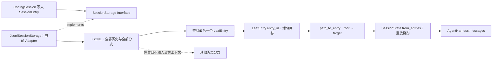

这条数据流形成两个清晰的 seam：`SessionStorage` 隔离持久化介质，`SessionState` 隔离历史表示与
Agent 运行时表示。其 Depth 在于：上层不需要理解 JSONL 行、parent 回溯、压缩替换和分支摘要的
细节，只消费恢复后的状态。

### 8.2 Entry 模型如何形成一棵树

所有节点都继承 `BaseSessionEntry`，共享：

```text
id + parent_id + timestamp + type-specific payload
```

[`SessionEntry`](../src/le_agent/session/entries.py) 是带 `type` discriminator 的联合类型：

| Entry | 作用 | 是否直接影响模型消息 |
|---|---|---|
| `MessageEntry` | 保存 user/assistant/tool result 消息 | 是 |
| `ModelChangeEntry` | 记录后续使用的模型 | 否，改变配置 |
| `ThinkingLevelChangeEntry` | 记录 thinking level | 否，改变配置 |
| `CompactionEntry` | 用 summary 替换指定的旧上下文行 | 是 |
| `BranchSummaryEntry` | 把被放弃分支的摘要带入新分支 | 是 |
| `LabelEntry` | 保存会话标签 | 否 |
| `LeafEntry` | 持久化“当前活动目标” | 否 |
| `SessionInfoEntry` | 保存 cwd、标题和创建时间 | 否 |
| `CustomEntry` | 保存扩展或应用拥有的数据 | 由上层解释 |

`parent_id` 是结构指针：普通节点以它指向前一个结构节点，因此多个节点可以拥有同一个 parent，
自然形成分叉。`LeafEntry` 则是导航记录，它的 `entry_id` 才是被选中的活动目标。LeAgent 写入 leaf 时通常
同时令 `parent_id == entry_id == target_id`，但之后新增消息会接到 `target_id`，不会接到
`LeafEntry.id`。因此在 CodingSession 正常的 active-target 重放中，leaf 行不在 root-to-target 路径上；
线性兼容重放或显式以 leaf 自身为目标时仍可能读到它，但它不产生模型消息。

例如，用户从 `A2` 回到 assistant 节点 `A1` 后重新提问（图中省略配置事件和 JSONL 中间的 leaf
导航记录）：

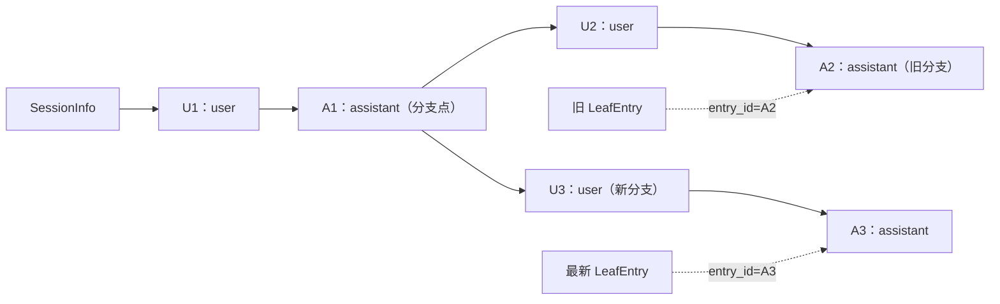

JSONL 仍保存 `U2 → A2`，但加载时最后一个 leaf 选择 `A3`，于是模型看到
`SessionInfo → U1 → A1 → U3 → A3` 对应的状态投影。

### 8.3 写入、加载与重放流程

正常一轮对话的持久化不是覆盖 transcript，而是反复追加：

```text
新 MessageEntry(parent_id = last_parent_id)
    ↓
新 LeafEntry(parent_id = message.id, entry_id = message.id)
    ↓
last_parent_id = message.id
```

`_last_parent_id` 是 CodingSession 下一次写入的结构 parent。把它设为消息、摘要或 compaction 的
id，而不是 leaf 自身的 id，可以让导航事件停留在控制平面，不污染对话树。

加载已有会话时，[`CodingSession`](../src/le_agent_coding/session.py) 读取所有行，寻找存储顺序中最后一个
`LeafEntry`，再把它的 `entry_id` 显式传给 `SessionState.from_entries()`。如果旧会话没有 leaf，才使用
线性重放兼容它。

[`path_to_entry()`](../src/le_agent/session/tree.py) 的实现是：

1. 先构建 `id → entry` 索引，并拒绝重复 id；
2. 从 target 沿 `parent_id` 反向走到 root；
3. 用 `seen` 检测 parent 环，遇到缺失节点立即报错；
4. 反转结果，得到 root-to-target 顺序。

构建索引为 `O(n)`，沿路径回溯为 `O(h)`，总复杂度是 `O(n + h)`。如果每一步都在线性数组中找
parent，最坏会退化到 `O(n × h)`。

[`SessionState.from_entries()`](../src/le_agent/session/memory.py) 有三个容易混淆的调用语义：

- 不传 `leaf_id`：按存储顺序线性重放全部 entries，用于兼容无 leaf 的历史；
- 显式传 `leaf_id="..."`：只重放 root-to-leaf 路径，这是会话树的正常恢复方式；
- 显式传 `leaf_id=None`：重放 root 之前的空路径。

重放同时投影 `messages`、model、thinking level、label、session info、custom entries、compaction
记录、`active_leaf_id` 与 `context_entry_ids`。因此 Harness 不必成为第二个会话数据库。

### 8.4 `branch_to_entry()` 的精确语义

[`branch_to_entry()`](../src/le_agent_coding/session.py) 是会话树的应用级操作。它先拒绝 Harness 正在运行时的
跳转，再验证目标存在且可以分支；随后只追加导航/摘要事件，不删除原分支。

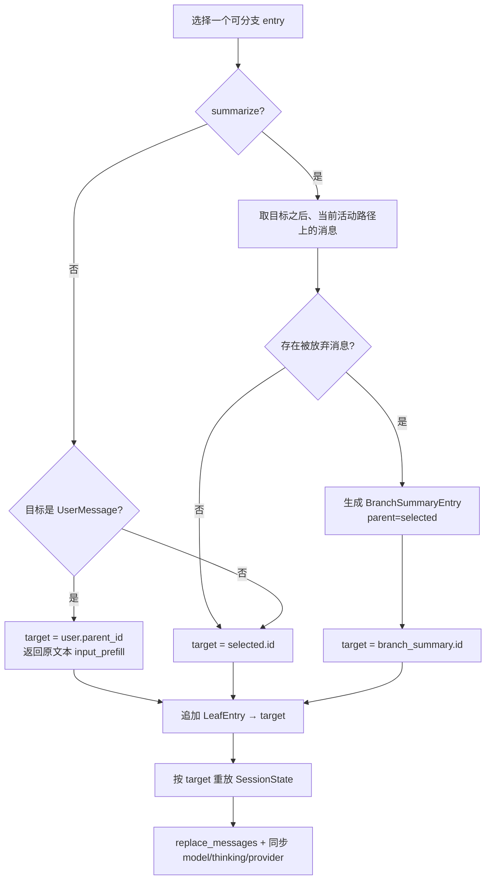

这里有四个面试时很容易说错的细节：

1. 不带摘要选择 `UserMessage` 时，不是从该消息之后继续。LeAgent 回到它的 parent，并把原文本作为
   `input_prefill` 返回，让用户编辑后重新提交，避免同一条 user message 被隐式复用。
2. `summarize=True` 只总结“目标之后且位于当前活动路径”的消息，不扫描 JSONL 中所有其他分支。
3. 如果目标不在当前活动路径，或目标之后没有消息，不创建 `BranchSummaryEntry`，直接以目标为
   target。
4. 操作完成后 `_last_parent_id = target_id`。后续节点从目标、branch summary 或 root 继续生长，
   而不是从刚写入的 `LeafEntry` 生长。

### 8.5 树选择器为什么不是简单按时间排序

[`tree_choices()`](../src/le_agent_coding/session.py) 面向 TUI 提供稳定的 `SessionTreeChoice`，但不会暴露每个
底层事件。可选项包括：

- user 与 assistant 的 `MessageEntry`；
- `CompactionEntry`；
- `BranchSummaryEntry`。

`ToolResultMessage`、配置事件、元数据、custom entry 和 `LeafEntry` 不作为分支选项。带 tool calls
的 assistant message 会标记 `is_tool_call=True`，供界面特殊渲染。

内部 `_ordered_tree_entries()` 使用迭代式深度优先遍历，而不是递归：长会话不会触发 Python 递归
深度限制；`expanded` 集合还会让异常 parent 环终止。断开连接的节点最后也会按存储顺序补入，避免
选择器把可检查的数据静默隐藏。注意这是“容错展示”策略；真正的语义重放仍由
`path_to_entry()` 严格拒绝环和缺失 id。

缩进也不是节点的绝对深度。`_tree_branch_indents()` 只在一个 parent 的第二个及后续 child 出现时
增加分支缩进，再把缩进传给后代。它表达的是“哪里发生了岔路”，比把很长的线性对话逐层右移更适合
终端界面。

### 8.6 Compaction 与 Branch Summary 的区别

两者都有 summary，却解决不同问题：

| 机制 | 何时使用 | parent | 对上下文的影响 | 对原历史的影响 |
|---|---|---|---|---|
| `CompactionEntry` | 当前活动上下文过长 | 当前 leaf | 用一条 summary 替换 `replaces_entry_ids` | 不删除 |
| `BranchSummaryEntry` | 回到旧节点并保留被放弃分支的信息 | 选中的分支点 | 追加一条“从该分支返回”的 user summary | 不删除 |

重放 `CompactionEntry` 时，[`memory.py`](../src/le_agent/session/memory.py) 删除投影中的指定 message
rows，并在第一个被替换位置插入 summary；如果替换 id 未出现在当前投影中，则把 summary 追加到末尾。
写入 compaction 后，CodingSession 还会追加指向它的 `LeafEntry`，把它设为新的结构 parent。

`BranchSummaryEntry` 则不会替换旧 rows。它在新分支上被投影为一条 `UserMessage`，告诉模型这段
摘要来自刚刚返回的分支。

共同不变量是：

```text
摘要改变“模型下一轮看到什么”，不改写“会话中已经发生过什么”。
```

这使压缩、回溯、审计能够同时成立，也让摘要错误可以通过原始历史复盘，而不是永久丢失证据。

### 8.7 JSONL、迁移与可靠性边界

[`JsonlSessionStorage`](../src/le_agent/session/storage.py) 让每个持久化 `SessionEntry` 独占一行，只提供
追加与完整读取。
其 Leverage 是实现很小，却同时支持：

- 不重写整份 transcript 就能记录新状态；
- 人工检查、导出和离线迁移；
- 用 parent 指针表达多个分支；
- 用 fake/in-memory storage 做确定性测试。

[`jsonl.py`](../src/le_agent/session/jsonl.py) 在反序列化 seam 迁移 LeAgent v1 的 user、assistant 与 tool
消息形状，随后交给严格的 discriminated union 校验。兼容逻辑集中在输入 Adapter，运行时就不必长期
支持两套协议；解析错误还会附带 JSONL 行号。

但“append-only”不等于数据库级可靠性。当前 storage Interface 没有承诺：

- 多进程写锁或并发事务；
- `fsync` 后的掉电持久性；
- 自动修复半行写入的 torn tail；
- 跨多个 entry 的原子提交。

因此消息和对应 leaf 是两次 append；如果进程恰好在中间退出，历史消息可能已保存，但活动指针还没
前移。LeAgent 在应用加载 seam 对外部/旧数据可做 missing-parent 脱离处理，也会修复中断工具调用需要的
结果，但核心 [`path_to_entry()`](../src/le_agent/session/tree.py) 仍保持严格：重复 id、缺失目标和 parent
环都会失败。校验和、文件锁或快照可隐藏在新 Storage Adapter 内；若要让 message 与 leaf 跨两次调用
原子提交，则必须扩展 `SessionStorage` Interface（例如增加 `append_many()` 或事务），或引入 Adapter
专有的日志恢复协议。

建议按这条路径调试会话树：

```text
先看 JSONL 最后一个 LeafEntry.entry_id
  → 检查目标是否存在
  → 沿 parent_id 手工回溯
  → 对照 SessionState.context_entry_ids
  → 再检查 Harness.messages 与 TUI tree choices
```

### 8.8 面试题与回答框架

#### Q1：LeAgent 为什么使用 append-only entries，而不是直接保存 messages 数组？

因为会话不仅有消息，还有模型切换、thinking level、label、摘要和扩展状态。追加式 entry 把这些变化
统一成事件协议，既保留审计历史，也能通过 `parent_id` 形成分支；运行时 messages 只是重放后的一个
投影。

#### Q2：`parent_id` 和 `LeafEntry.entry_id` 有什么区别？

`parent_id` 定义节点之间的历史结构；最新 `LeafEntry.entry_id` 选择当前要重放到哪个目标。LeafEntry
是持久化的导航事件，不是新的对话内容，后续消息也不会以 `LeafEntry.id` 为 parent。

#### Q3：恢复当前上下文的完整流程是什么？

读取全部 entries，找到最后一个 LeafEntry，取其 `entry_id`，用 `path_to_entry()` 得到 root-to-target
路径，再由 `SessionState.from_entries()` 投影 messages 与配置，最后同步给 AgentHarness；如果历史中
没有任何 LeafEntry，`CodingSession.load()` 回退为按存储顺序线性重放。

#### Q4：为什么选择历史 UserMessage 时要回到它的 parent？

在 `summarize=False` 时，LeAgent 把 target 设为该 user entry 的 `parent_id`，并把原文本作为
`input_prefill` 返回给调用方；重新提交后才会形成新的 UserMessage 分支。

#### Q5：分支摘要会总结整个会话树吗？

不会。它只获取选中节点之后、当前 active path 上的 message entries。其他分支以及模型配置、标签等
非消息事件不进入摘要输入；活动路径上的 `ToolResultMessage` 仍属于 message，会进入摘要。目标不在
活动路径时也不会生成摘要。

#### Q6：Compaction 为什么不直接删除被压缩消息？

删除会破坏审计、回溯和重新生成摘要的能力。LeAgent 只在 `SessionState` 投影时用 summary 替换指定 ids，
JSONL 原始行保持不变，实现“历史不可变、上下文可变”。

#### Q7：树遍历如何处理深链、环和断开的节点？

语义恢复使用 parent 回溯和 `seen`，严格拒绝环、重复 id 与缺失目标；选择器展示使用迭代 DFS，避免
递归溢出并终止异常环，最后补入断开节点。两种 Implementation 服务于不同目标，不能混为一谈。

#### Q8：这个设计的一致性窗口在哪里？

一条消息和推进 active leaf 是两次 append，不具备跨行事务。中途崩溃可能留下已保存但尚未成为活动
目标的 entry。若要求更强保证，可在 `SessionStorage` seam 下增加事务日志、校验和或原子批量追加，
而无需改变 CodingSession 的状态投影思想。

#### Q9：会话树的时间和空间复杂度如何？

一次路径恢复先用 `O(n)` 建索引，再用 `O(h)` 回溯活动链；JSONL 空间随全部历史线性增长。Compaction
只缩短模型上下文，不回收存储空间；若长期运行，还需要独立的归档、快照或垃圾回收策略。

#### Q10：如果让你继续演进这个 Module，会优先做什么？

我会保持 `SessionState` 的投影语义稳定，先扩展 `SessionStorage` Interface，增加 entry 批量原子追加，
并在 Adapter 内加入尾行校验；再增加周期快照以减少 `O(n)` 全量读取；最后设计可验证的归档/GC，
只回收已明确不可达且已导出的分支。这样增强可靠性与性能，同时保持核心树语义的 Locality。

## 9. CLI、Renderer 与 Textual TUI

### 9.1 Print mode

`run_print_mode()` 创建 CodingSession，再根据输出模式选择 renderer：

- text：面向人类的最终文本；
- json：机器可读事件流；
- transcript：完整对话视图。

renderer 位于 [`le_agent_coding/rendering/`](../src/le_agent_coding/rendering)。它们只消费事件，不调用
Provider，也不维护 Agent transcript。

### 9.2 Textual TUI

Textual app 的事件适配边界是
[`TuiEventAdapter.apply()`](../src/le_agent_coding/tui/adapter.py)。它把 `CodingSessionEvent` 单向投影到
`TuiState`：

- text delta 进入临时 assistant buffer；
- 最终消息替换临时行；
- tool events 更新工具卡片；
- queue/compaction/retry 更新状态；
- `agent_settled` 结束 running 状态。

TUI adapter 不反向调用 Agent Loop。这使事件流仍然是核心与前端之间唯一契约。

### 9.3 自己写前端需要什么

最小前端只需要：

```python
async for event in session.prompt(user_text):
    render(event)
```

真实交互前端还应处理命令、并发提交、取消、会话切换，以及用 `agent_settled` 判断真正结束。
可继续阅读内置 [`architecture.md`](../src/le_agent_coding/data/docs/architecture.md) 和
[`tui.md`](../src/le_agent_coding/data/docs/tui.md)。

## 10. 关键模块逐层解析

### 10.1 `le_agent_ai`

#### 10.1.1 定位与依赖倒置

可移植的 `ModelProvider` 与 `CancellationToken` Protocol 归
[`le_agent/provider.py`](../src/le_agent/provider.py) 所有：Agent Loop 只依赖
`stream_response(*, model, system, messages, tools, signal) -> AsyncIterator[AssistantMessageEvent]`。
[`le_agent_ai/provider.py`](../src/le_agent_ai/provider.py) 只是重新导出这两个协议；具体 Adapter
依赖 Agent 的 `AgentMessage`、`AgentTool` 类型，却把 HTTP 与各家 wire format 藏在实现内。因此新增
供应商不应迫使 Agent Loop 认识某个 SDK 或 SSE 字段。运行时 Provider 选择与应用配置仍属于
[`le_agent_coding/provider_runtime.py`](../src/le_agent_coding/provider_runtime.py)，而非 `le_agent_ai`。

#### 10.1.2 模块架构图

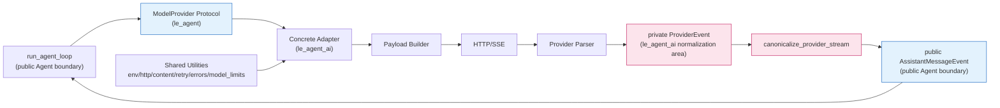

图中的粉色区域是 `le_agent_ai` 内部的归一化边界：私有事件不会越过它；蓝色节点才是
`le_agent` 面向 Agent Loop 的公开契约。

#### 10.1.3 一次模型请求的完整流转

一次请求按下面七步完成：

1. Agent Loop 只调用 `ModelProvider.stream_response()` 的中立参数：`model`、`system`、`messages`、`tools` 与取消 `signal`。
2. Adapter 将 system、消息、图片、工具和 reasoning 选项序列化为供应商 payload。
3. [`OpenAICompatibleProvider`](../src/le_agent_ai/openai_compatible.py) 选择 Chat Completions 或 Responses API；其他 Adapter 保留自己的 wire format。
4. 具体 Adapter 的 transport/request envelope 发出 `ProviderResponseStartEvent`，决定重试并发出 `ProviderRetryEvent`，同时处理 transport error；供应商专属 payload parser 产生 text/thinking delta、完整的 `ProviderToolCallEvent`、终态 response 和 payload-level error。
5. [`canonicalize_provider_stream()`](../src/le_agent_ai/stream.py) 把这些私有事件组装为一个按顺序增长的 partial assistant message。
6. `ProviderResponseEndEvent` 的终态 metadata 补充 usage、finish reason 与签名/replay metadata，不能重排已流出的内容。
7. 公开流最终以 `AssistantDoneEvent` 或 `AssistantErrorEvent` 回到 Agent Loop。

例如，私有序列 `thinking → text → tool call → done` 会被公开为
`AssistantStartEvent → ThinkingStart/Delta/End → TextStart/Delta/End → ToolCallStart/End → AssistantDoneEvent`。
这样 UI 可以逐块渲染，而 Loop 无须理解某一家供应商的增量格式。

#### 10.1.4 两级事件模型与流式状态机

| 层级 | 代表类型 | 职责 | 谁消费 |
| --- | --- | --- | --- |
| 私有解析层 | [`ProviderEvent`](../src/le_agent_ai/_provider_events.py) 及其 variants | 屏蔽每家 parser 的字段、重试与错误细节 | Adapter 与 canonicalizer |
| 公开 Agent 层 | [`AssistantMessageEvent`](../src/le_agent/provider_events.py)（[`le_agent_ai/events.py`](../src/le_agent_ai/events.py) 仅 re-export） | 统一 start/delta/end/done/error 的消费协议 | Agent Loop、前端 |

[`stream.py`](../src/le_agent_ai/stream.py) 的状态机维护 `partial`（正在组装的
`AssistantMessage`）、`active_index`（当前 text/thinking block 的 content 下标）、
`active_kind`（`text` 或 `thinking`）、`started`（是否已发送开始事件）和 `terminal`
（是否已得到终态）。它遵守以下不变量：

- text 与 thinking 切换前先结束前一个 block；
- `ToolCall` 先关闭活动 text/thinking block，随后以独立 content index 占据自己的 block；
- 每次流式 `partial` snapshot 都通过 deep copy 产生，异步消费者不会观察到后续突变；
- 流出的 block 顺序是权威来源；终态 message 只补 usage 与 replay metadata（如签名），不改顺序；
- 缺少 start 会自动补 `AssistantStartEvent`；流结束却没有 terminal 会收敛为 provider error。

#### 10.1.5 Provider 适配器与公共设施

| Adapter | API / 特性 | 阅读重点 |
| --- | --- | --- |
| [`OpenAICompatibleProvider`](../src/le_agent_ai/openai_compatible.py) | Chat Completions 与 Responses API | 两套 payload、SSE parser 与路由选择 |
| [`OpenAICodexProvider`](../src/le_agent_ai/openai_codex.py) | Codex Responses stream、Codex credentials、运行时 model limits | credential resolver 与 `discover_model_limits()` |
| [`MistralConversationsProvider`](../src/le_agent_ai/mistral.py) | Conversations API 语义与 Mistral stream parser | payload 与 `_MistralStreamParser`；当前端点为 `chat/completions` |

| 公共文件 | 一个责任 | 一个阅读焦点 |
| --- | --- | --- |
| [`content.py`](../src/le_agent_ai/content.py) | 提取文本与图片 | 非视觉模型的图片占位规则 |
| [`env.py`](../src/le_agent_ai/env.py) | Provider 底层环境配置 | config 与环境变量默认值 |
| [`http.py`](../src/le_agent_ai/http.py) | HTTP client 与代理规范化 | `create_async_client()` 和 proxy 环境 |
| [`http_errors.py`](../src/le_agent_ai/http_errors.py) | 提取供应商错误详情 | 截断并格式化 response body |
| [`retry.py`](../src/le_agent_ai/retry.py) | 指数退避与可取消等待 | delay 计算和 polling cancellation |
| [`model_limits.py`](../src/le_agent_ai/model_limits.py) | 运行时模型上限协议 | `RuntimeModelLimits` 与 `ModelLimitsProvider` |
| [`fake.py`](../src/le_agent_ai/fake.py) | 确定性的 `ModelProvider` 测试替身 | 作为生产端重放预制公开事件，并记录调用 |

#### 10.1.6 重试、取消与错误收敛

具体 Adapter 的 transport/request envelope 检测瞬时 HTTP/network 条件，决定是否重试并发出
`ProviderRetryEvent`；供应商专属 parser 负责 response payload 的事件转换。 [`retry.py`](../src/le_agent_ai/retry.py)
提供有上限的指数退避 `retry_delay_seconds()`、`ProviderRetryEvent` 构造与每 `0.05` 秒检查取消的
`wait_for_retry()`，但不决定重试条件。`ProviderRetryEvent` 在 `canonicalize_provider_stream()` 内被消费，
不成为公开的 `AssistantMessageEvent`，因此上层只看见最终成功或统一的 `AssistantErrorEvent`。

| 机制 | 所在层 | 做什么 | 边界 |
| --- | --- | --- | --- |
| Provider Retry | 具体 Adapter | 处理瞬时网络/HTTP 错误并等待后重试 | 是否安全取决于 Adapter 与当前 stream state；不能声称任意已部分输出的流都可重放 |
| Context Overflow Retry | `le_agent_coding.CodingSession` | 压缩 context 后执行一次应用级 rerun | 这是会话编排，不是 Provider 传输重试 |

HTTP、解析和没有终态的流最终都经私有错误事件或 canonicalizer 收敛到 `AssistantErrorEvent`。

#### 10.1.7 阅读顺序与调试方法

建议按这个顺序阅读，而不是先钻进最长的 payload builder：

```text
provider.py → fake.py → _provider_events.py → events.py → stream.py
→ retry.py/http_errors.py → one concrete adapter → tests/test_le_agent_ai.py
```

调试一次真实请求时，在 `stream_response()`、Adapter 的 `_stream*()` 方法、对应 parser 与
`canonicalize_provider_stream()` 设断点。依次检查 payload、私有事件、`partial.content`、
`active_index`、usage、finish reason，以及最后一个公开事件；
[`tests/test_le_agent_ai.py`](../tests/test_le_agent_ai.py) 是这些边界的可执行样例。

#### 10.1.8 高频面试题

##### Q1：为什么 `ModelProvider` 放在 `le_agent`？

[`le_agent/provider.py`](../src/le_agent/provider.py) 定义可移植 Protocol，让 Agent Loop 依赖抽象，`le_agent_ai` 只提供结构化实现，避免核心反向依赖供应商。

##### Q2：为什么有私有和公开两级事件？

[`_provider_events.py`](../src/le_agent_ai/_provider_events.py) 接住各家 parser 差异；
[`le_agent/provider_events.py`](../src/le_agent/provider_events.py) 定义稳定的公开 `AssistantMessageEvent`，
而 [`le_agent_ai/events.py`](../src/le_agent_ai/events.py) 只 re-export 它，从而隔离 wire format。

##### Q3：内容顺序由谁决定，终态 metadata 又归谁？

[`canonicalize_provider_stream()`](../src/le_agent_ai/stream.py) 中 streamed `partial.content` 决定顺序；`ProviderResponseEndEvent.message` 只补 usage、finish reason 和 replay metadata。

##### Q4：text、thinking、tool call 怎样保持有序？

`stream.py` 用 `active_index`/`active_kind` 关闭旧块；`ProviderToolCallEvent` 先关闭活动块，再追加独立的 ToolCall content block。

##### Q5：为什么每次事件要使用不可变 snapshot？

`_snapshot()` 在 [`stream.py`](../src/le_agent_ai/stream.py) 中 deep copy `AssistantMessage`，所以异步 UI 或日志消费者不会被随后 delta 改写已接收状态。

##### Q6：为什么 `ProviderRetryEvent` 不暴露给 Agent Loop？

它是 [`_provider_events.py`](../src/le_agent_ai/_provider_events.py) 的 Adapter 内部进度；canonicalizer 消费它，保持 `ModelProvider` 公开事件契约简洁。

##### Q7：Provider Retry 和 Context Overflow Retry 有何区别？

具体 Adapter 的 transport/request envelope 决定瞬时 HTTP/network 条件是否重试并发出 `ProviderRetryEvent`；
[`retry.py`](../src/le_agent_ai/retry.py) 只提供有上限的退避、retry-event 构造和可取消等待。
`le_agent_coding.CodingSession` 的 overflow retry 则先做 context compaction，再进行一次应用级 rerun。

##### Q8：怎样新增 Provider 而不改 Agent Loop？

`ModelProvider` 只要求 `stream_response()` 返回 `AsyncIterator[AssistantMessageEvent]`。当前先产生私有
`ProviderEvent` 的网络 Adapter 把它接入 [`canonicalize_provider_stream()`](../src/le_agent_ai/stream.py) 作为标准桥接；
[`FakeProvider`](../src/le_agent_ai/fake.py) 则可直接产生公开事件，Agent Loop 始终只消费 `AssistantMessageEvent`。

##### Q9：为什么 `FakeProvider` 是架构能力而不只是普通 mock？

[`FakeProvider`](../src/le_agent_ai/fake.py) 是生产端的确定性 `ModelProvider` 测试替身：它重放预制公开事件并记录调用。 [`tests/test_le_agent_ai.py`](../tests/test_le_agent_ai.py) 验证 Provider/event normalization 与替身行为；[`tests/test_agent_loop.py`](../tests/test_agent_loop.py) 覆盖 Agent Loop 边界。

##### Q10：流结束却没有 terminal event 时怎么办？

[`stream.py`](../src/le_agent_ai/stream.py) 发现 `terminal` 仍为 false，就合成带 “Provider stream ended without a terminal event” 的 `AssistantErrorEvent`，避免静默成功。

### 10.2 `le_agent`

#### 10.2.1 定位、Interface 与 Seam

`le_agent` 是不认识 CLI、Textual、cwd、会话文件位置和具体模型厂商的可移植 Agent Module。
它提供消息、Provider、Tool、事件、Loop、Harness 和 Session 原语；调用方只需在几个明确 Seam 上
注入 Adapter，就能复用完整的模型—工具循环。

| Interface / Seam | 调用方需要提供或消费什么 | 当前 Adapter |
| --- | --- | --- |
| Provider | [`ModelProvider.stream_response()`](../src/le_agent/provider.py) 返回 `AssistantMessageEvent` 异步流 | `le_agent_ai` Provider、`FakeProvider` |
| Tool | [`AgentTool`](../src/le_agent/tools.py) 的 JSON Schema 与异步 executor | `le_agent_coding` 工具、Extension Tool |
| Agent Event | 消费 [`AgentEvent`](../src/le_agent/events.py) 的 run/turn/message/tool 生命周期 | CodingSession、Renderer、Extension |
| Tool Policy | 注入 `before_tool_call` / `after_tool_call` callback | 权限门、审计或结果改写策略 |
| Session Storage | [`SessionStorage.append/read_all`](../src/le_agent/session/storage.py) | `JsonlSessionStorage` 或自定义存储 |

这个 Module 的 Depth 来自窄 Interface 背后的行为：Provider 不必知道工具执行，Tool 不必知道模型，
调用方却能获得流式事件、transcript 回填、队列、取消与可重放 Session。供应商 payload、文件系统和 UI
知识留在外层，相关变化不会扩散到 Loop，形成较好的 Locality。

#### 10.2.2 模块架构图

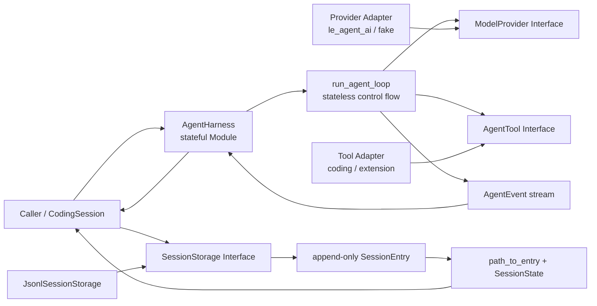

图中有两条彼此独立的路径：运行时由 Harness 调 Loop，持久化时由应用层调用 Session 原语。
`AgentHarness` 不会自动写 JSONL；`SessionState` 也不会反向启动模型。这种分离让 Harness 可用于
非 coding 场景，也允许应用替换 Storage Adapter。

#### 10.2.3 消息、Provider 事件、Agent 事件与 Tool 协议

[`messages.py`](../src/le_agent/messages.py) 里的 Message 是可持久化、可重放的事实；系统提示词不是
独立 Message role，而是 `ModelProvider` 的 `system: str` 参数。`AssistantMessage.content` 按生成顺序
保存 `TextContent | ThinkingContent | ToolCall`，`tool_calls` 只是从有序内容块派生的只读视图。

事件分两层：

| 层 | 代表类型 | 回答的问题 |
| --- | --- | --- |
| Provider Stream | [`AssistantMessageEvent`](../src/le_agent/provider_events.py) | 模型正在生成哪个 text/thinking/tool block？ |
| Agent Lifecycle | [`AgentEvent`](../src/le_agent/events.py) | run、turn、message 和 tool execution 处于什么阶段？ |

[`_assistant_events()`](../src/le_agent/loop.py) 把前者映射为后者：start 变成 `MessageStartEvent`，
delta 变成携带嵌套 Provider Event 的 `MessageUpdateEvent`，done/error 变成权威的
`MessageEndEvent`。因此 UI 能显示增量，持久化又只依赖最终 Message。

`AgentTool` 同时保存给模型看的 `name/description/parameters` 与运行时 executor。executor 接收
tool-call id、arguments、取消信号和 progress callback，返回 `AgentToolResult`。
`execution_mode="sequential"|"parallel"` 会参与核心 Loop 调度：默认为并行，批次中任一已知工具为
`sequential` 时整批串行。

#### 10.2.4 `run_agent_loop()` 的完整流转

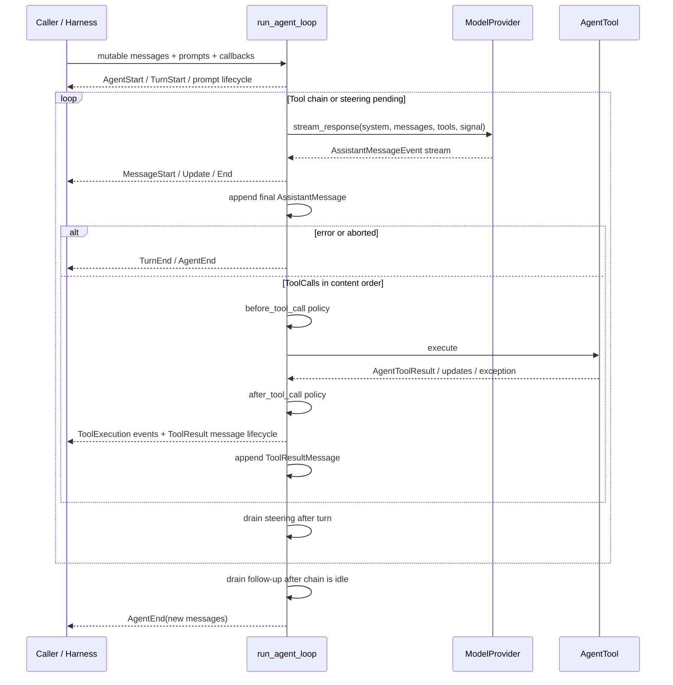

关键顺序如下：

1. Prompt 先追加到调用方持有的 `messages`，并发出 message lifecycle；`new_messages` 只记录本 run 新增内容。
2. Provider Stream 正常结束却没有 terminal assistant message 时，Loop 合成 error message；若异步迭代器本身抛异常，异常会向调用方传播。
3. `_provider_context()` 保留 durable failure 作为诊断历史，但过滤无 content 的 error/aborted assistant，避免下次 Provider 拒绝 replay。
4. error/aborted assistant 是本 run 的终点，不执行它携带的 ToolCall，也不处理 follow-up。
5. ToolCall 先按 content 顺序 preflight；batch 为并行时同时启动 worker，否则逐个执行。
6. 完成事件可按实际完成顺序发出，`ToolResultMessage` 始终按源 ToolCall 顺序回填 transcript。
7. 普通 Tool Exception 转为 error `AgentToolResult`；只有 `asyncio.CancelledError` 继续抛出。
8. Policy Callback 正常返回时，每个调用都会生成对应 `ToolResultMessage` 并回填 transcript；before/after callback 自身抛异常会终止该 run。
9. 每个 `TurnEnd` 后取 steering（即使该 Turn 没有 Tool）；整个工具链自然空闲后才取 follow-up。

#### 10.2.5 `AgentHarness`：状态、队列、取消与 Repair

[`AgentHarness`](../src/le_agent/harness.py) 是纯 Loop 外的有状态 Module。它拥有唯一的可变
transcript、listener、`_running`、当前 cancellation token，以及 steering/follow-up 两个 deque；
但它不拥有磁盘持久化、压缩、Provider 创建或 UI。

- `prompt_message()` 添加新输入，`continue_()` 从现有 transcript 继续；两者都拒绝重叠 run。
- 运行中再次调用 prompt/continue 会抛 `RuntimeError`，只能用 `steer()` 或 `follow_up()` 排队。
- `queue_mode="one_at_a_time"` 每次排一条，`"all"` 才一次排空当前队列。
- `cancel()` 只设置协作式 token；Provider 与 Tool 必须主动检查，它不是强杀任意 Task。
- `_run()` 先把事件通知 listener，再向调用方 yield；listener 可同步或异步，并按注册顺序等待。
- 取消或恢复前，`_append_interrupted_tool_results()` 为没有 result 的 ToolCall 补一条
  `is_error=True` 的 synthetic `ToolResultMessage`，并用 ID 去重。

Repair 的目的不是伪造成功，而是维护 Provider transcript 的结构不变量：已经出现的 ToolCall
必须能找到一个对应 Result。CodingSession 还会把加载时的 repair 持久化，避免下次恢复再次损坏。

#### 10.2.6 Append-only Session Tree、Memory 与 Storage

[`session/entries.py`](../src/le_agent/session/entries.py) 把 Message、Model/Thinking 变更、Compaction、
Branch Summary、Label、Leaf、Session Info 和 Custom Data 都建模为带 `id + parent_id + timestamp` 的
判别 Entry。旧节点不覆写，分支通过新的 parent 关系自然形成。

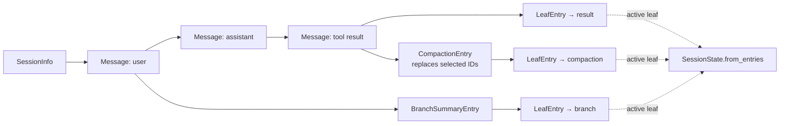

[`path_to_entry()`](../src/le_agent/session/tree.py) 会拒绝重复 ID、缺失 parent 和环，再返回
root-to-leaf path。[`SessionState.from_entries()`](../src/le_agent/session/memory.py) 指定 leaf 时只重放
活动路径；不传 leaf 时按 storage 顺序线性重放。`CompactionEntry.replaces_entry_ids` 只改变重建出的
Context：首个被替换位置变成 Summary UserMessage，旧 JSONL Entry 仍然存在。

`SessionStorage` 只有 `append()` 与 `read_all()`，因此 JSONL 只是一个 Adapter。
[`jsonl.py`](../src/le_agent/session/jsonl.py) 用严格 Pydantic 判别联合解析，并只在反序列化入口迁移
LeAgent v1；非法行抛 `SessionJsonlError`。当前 `JsonlSessionStorage` 没有跨进程锁、事务、`fsync` 或
torn-tail 自动修复，不能把 append-only 等同于数据库级 durability。

#### 10.2.7 能力边界、阅读顺序与调试方法

| 容易过度描述的能力 | LeAgent 当前实现 |
| --- | --- |
| 并行 ToolCall | 批次默认并行；任一工具标记 `sequential` 时整批串行，尚未细化到资源冲突图 |
| Tool 参数模型 | 模型看到 JSON Schema，executor 接收 `Mapping[str, JSONValue]`；Core 不强制每个 Tool 使用独立 Pydantic args model |
| 线程安全 Harness | `_running` 约束常规单事件循环重叠，不是跨线程锁 |
| 自动持久化 | Harness 只持内存 transcript；持久化由调用方/CodingSession 完成 |
| 强制取消 | cancellation 是协作式 token，不保证终止不检查信号的实现 |
| 可靠 JSONL 数据库 | 当前没有事务、跨进程锁和损坏尾行恢复 |

推荐阅读顺序：

```text
messages.py → provider_events.py → events.py → tools.py → loop.py
→ harness.py → session/entries.py → tree.py → memory.py → storage.py/jsonl.py
```

调试“模型为何没看到工具结果”时，在 `run_agent_loop()` 最终 assistant append 后和
`_execute_tool_calls()` 的 `MessageEndEvent(ToolResultMessage)` 处断点；调试队列/取消看
`AgentHarness._run()` 与两个 drain；调试恢复错误先看 `path_to_entry()` 和
`SessionState.from_entries()`。可执行证据集中在
[`test_agent_loop.py`](../tests/test_agent_loop.py)、[`test_agent_harness.py`](../tests/test_agent_harness.py)
和 [`test_session.py`](../tests/test_session.py)。

#### 10.2.8 高频面试题

##### Q1：为什么 Loop 与 Harness 要分开？

[`run_agent_loop()`](../src/le_agent/loop.py) 通过参数和 callback 接收全部依赖，便于用 Fake Provider/Tool
确定性测试；Harness 再增加 transcript ownership、single-run、queue、cancel 和 listener 状态。

##### Q2：为什么 Message 和 Event 不能合并？

Message 是持久化事实；Event 是执行过程。`MessageUpdateEvent` 可丢弃，最终
`MessageEndEvent.message` 才应写入历史。

##### Q3：为什么 Tool Result 必须进入 transcript？

仅在 UI 打印不会进入下一次 Provider Context；Loop 追加 [`ToolResultMessage`](../src/le_agent/messages.py)
后，模型才看得到文件内容、命令输出或错误。

##### Q4：Tool Exception 会终止整个 Agent 吗？

通常不会。`_run_tool_worker()` 把普通 Exception 转为 error result，让模型有机会纠正；
`asyncio.CancelledError` 保留取消语义并重新抛出。

##### Q5：Steering 和 Follow-up 在哪里注入？

Steering 在每个 Turn 结束后、下一次模型调用前 drain；Follow-up 只在当前工具链和
Steering 都耗尽后才成为新的 pending 输入。

##### Q6：`execution_mode="parallel"` 如何影响工具执行？

Loop 默认允许同一 AssistantMessage 的 ToolCall 并行。它会按源顺序完成 preflight 和
`before_tool_call`，并行执行 worker，按完成顺序发出 end/update 事件，再按源顺序回填结果。
若全局 `tool_execution="sequential"` 或批次中任一已知工具标记为 `sequential`，整批串行。

##### Q7：如何防止两个 run 同时修改 transcript？

Harness 的 `_ensure_not_running()` 拒绝第二个 prompt/continue，运行中输入必须排队；它解决的是
常规事件循环重入，不是通用线程同步。

##### Q8：取消后为什么要补 ToolResult？

Assistant 已声明 ToolCall 却没有对应 Result 时，Provider 可能拒绝后续 transcript。Harness 按 ID
补 synthetic error Result，CodingSession 加载时还会把修复写入 Session。

##### Q9：Session Tree 怎样保留分支又只发送一条 Context？

所有 Entry 仍留在 append-only storage；`LeafEntry` 选择活动节点，`path_to_entry()` 与
`SessionState` 只重放该 root-to-leaf path。

##### Q10：为什么失败 Assistant 既保存又可能不发给下一次 Provider？

失败是有诊断价值的 durable fact；但无 content 的 error/aborted assistant 不是所有 Provider 都能
接受的 replay message，因此 `_provider_context()` 只在请求前过滤它，不删除历史。

### 10.3 `le_agent_coding`

#### 10.3.1 定位与两个核心 Seam

`le_agent_coding` 是把可移植 `AgentHarness` 装配成 Coding App 的 Module，不是第二个 Agent Loop。
它拥有 cwd、Provider 配置、文件/Shell Tools、Resources、Extensions、Commands、持久化、Context Policy
和前端事件；真正的 Provider→Tool 控制流仍只有 [`run_agent_loop()`](../src/le_agent/loop.py)。

两个最重要的 Seam 是：

- [`CodingSession.load()`](../src/le_agent_coding/session.py)：composition root，从 Config、Storage 和当前资源构造可运行 Session；
- `CodingSession.prompt()`：application orchestration seam，在 Harness Event 外围增加输入展开、持久化、压缩、重试和 settled 语义。

Host 提供 `CodingSessionConfig`，就能得到一个深 Module；资源 precedence、Extension 组合、旧 Session
Repair 和模型能力同步都藏在 Implementation 内。代价是 `CodingSession` 的公开 Interface 较大，阅读时
应按数据流选方法，而不是从文件第一行顺序读到最后。

#### 10.3.2 模块架构图

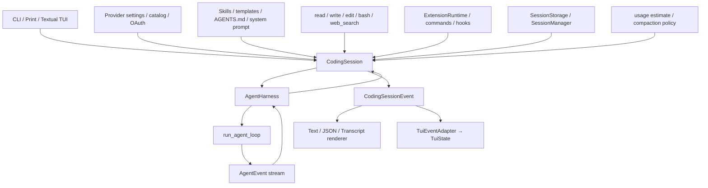

前端只提交 Command 或 Prompt 并消费 Event；它不应直接操纵 Loop transcript。CodingSession 把
资源和应用策略变成 Harness Config，并把低层 `AgentEndEvent` 包装成应用事件，直到真正 settled。

#### 10.3.3 `CodingSession.load()` 的装配流

`load()` 按以下顺序完成 composition：

1. `storage.read_all()`；空 Storage 只在内存创建 SessionInfo/Model/Thinking 初始 Entry，延迟到首次持久化再建文件。
2. 对外部历史的 missing parent 做 root detach，再以最新 `LeafEntry` 重建活动 `SessionState`；无 leaf 时线性重放。
3. 绑定 cwd 后加载 Skills、Prompt Templates、Project Context 和非致命 Diagnostics。
4. 取得或创建 `ExtensionRuntime`；Project Extension 默认关闭，因为它会在启动时执行项目 Python。
5. 选择活动 Model 与图片能力，创建默认 read/write/edit/bash/web_search 或使用注入 Tools，再由 Extension 组合。
6. 未显式传 `system` 时，用 Tools、Guidelines、Context 和自定义片段确定性组装 System Prompt；Skills Index 只在 `read` Tool 可用时加入。
7. 用当前 Provider、Model、System、Tools 和恢复 Messages 构造 `AgentHarness` 与 CodingSession。
8. 持久化旧历史中的 interrupted Tool Repair，并刷新 Runtime Provider/Model Limits；仅在本次新建 `ExtensionRuntime` 时执行 bind/listener 安装，并把 `session_start` 延迟到 Host 安装 UI Bridge 后发送。复用 Runtime 的 Resume/New/Branch 由 replacement adoption 流程重新绑定。

“仅 load 空 Session 不创建 JSONL”是一个容易忽略的不变量：初始 Entry 保存在
`_pending_initial_entries`，首次确认消息或显式初始化时才写盘。

#### 10.3.4 `prompt()`：输入、持久化、Overflow Retry 与 Settled

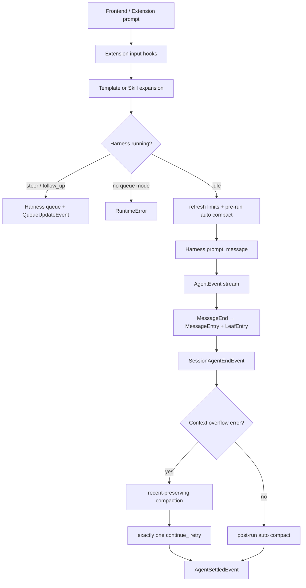

精确流转如下：

- Input Hook 可改写文本或 `handled` 后直接结束；随后 Template Expansion 优先于 Skill Expansion。
- Harness 正在运行时，只有显式 `streaming_behavior="steer"|"follow_up"` 合法；否则抛 `RuntimeError`，不会并发调用 Provider。
- idle 时刷新 Runtime Model Limits、尝试 pre-run auto compact，再构造 `UserMessage` 或 `CustomMessage` 交给 Harness。
- 每个 `MessageEndEvent` 都触发增量持久化：追加 `MessageEntry` 与 `LeafEntry`；Stream Delta 不写盘。
- Assistant Error 会写脱敏诊断；Context Overflow 目前通过 Error Message Marker 识别。
- Overflow 时生成保留近期消息的 Compaction，成功后只执行一次、无延迟的 `Harness.continue_()` Retry；失败不无限重试。
- `SessionAgentEndEvent` 只说明底层 Loop 已发出 terminal event，后面仍可能 Compact/Retry；只有 `AgentSettledEvent` 才是前端解除 loading 的应用终点。

当前 `AutoRetryEndEvent(success=True)` 表示一次 Retry 流程执行完，不等于 Retry 的 Assistant 一定成功；
判断最终回答仍应看 Message/Event，而不能只看这个布尔值。

#### 10.3.5 Provider、Tools、Resources、Extensions 与 Commands

| 应用 Module | 核心职责 | 重要 Seam / 边界 |
| --- | --- | --- |
| [`provider_config.py`](../src/le_agent_coding/provider_config.py) | Provider/Model/Thinking 偏好、能力与校验 | Durable Config，不是 Runtime HTTP Adapter |
| [`provider_runtime.py`](../src/le_agent_coding/provider_runtime.py) | Config + Credential → `le_agent_ai` Provider | OAuth Refresh 按 event loop + credential name 加 async lock；不是跨进程锁 |
| [`credentials.py`](../src/le_agent_coding/credentials.py) / [`oauth_registry.py`](../src/le_agent_coding/oauth_registry.py) | Credential File 与 OAuth Provider Registry | 0600 + replace 降低暴露，但不是 OS Keychain 或加密 Secret Manager |
| [`tools.py`](../src/le_agent_coding/tools.py) | `ToolDefinition` 适配为 `AgentTool` | 默认 read/write/edit/bash/web_search；cwd 是解析基准，不是 Sandbox |
| [`web_search.py`](../src/le_agent_coding/web_search.py) | 搜索后端协议、Tavily 适配与结果归一化 | keyless 配额、取消检查与结构化引用 |
| [`resources.py`](../src/le_agent_coding/resources.py) / [`context.py`](../src/le_agent_coding/context.py) | 用户/项目 Resources 与 AGENTS.md 发现 | 递增 precedence、去重、非致命 Diagnostic |
| [`skills.py`](../src/le_agent_coding/skills.py) / [`prompt_templates.py`](../src/le_agent_coding/prompt_templates.py) | Skill Index、Invocation 与 Template Expansion | System Prompt 默认只注入索引；显式 `/skill:` Invocation 把加载时已读入的完整正文展开到 Prompt |
| [`system_prompt.py`](../src/le_agent_coding/system_prompt.py) | 确定性组合 Tools、Guidelines、Context、Skills、Date/Cwd | Custom Prompt 替换默认主体，但仍按规则附加其他段 |
| [`extensions/runtime.py`](../src/le_agent_coding/extensions/runtime.py) | 注册/组合 Tool、Command、Hook、Renderer、UI | Tool-call Hook 可改参/Block；异常 fail-safe block，Project Extension 默认 opt-in |
| [`commands.py`](../src/le_agent_coding/commands.py) | CLI/TUI 共享 Slash Command Registry | 返回 `CommandResult` 请求，异步 UI/Session 动作由 Host 执行 |

Coding Tool 的安全边界必须如实说明：相对路径基于 cwd，但绝对路径和 `../` 当前均可访问；write/edit
只有同进程、同 resolved path 的 async lock；Bash 支持 timeout/cancel 并截断输出，在 POSIX 上终止
进程组、非 POSIX 上终止直接 Subprocess，但默认没有统一 readonly/confirm/trust 权限模式。
Extension Hook 能实现权限策略，却不是内置的统一权限系统。

#### 10.3.6 持久化、Context Accounting 与 Compaction

CodingSession 在 `le_agent.session` 原语之上增加应用 Policy：

- `_persist_messages_since()` 以确认 Message 为 durability seam，逐条追加 `MessageEntry + LeafEntry`，再重放活动 State；
- `_persist_loaded_interrupted_tool_repairs()` 把加载时 synthetic Tool Result 也写回 Storage；
- `branch_to_entry()` 通常以所选历史节点为新 parent，并可对离开的分支生成 `BranchSummaryEntry`；若选择的是 `UserMessage` 且不生成 Summary，则改用该 Entry 的 parent，并把原输入作为 Prefill 返回，供用户编辑后重发；
- Session Index、Export、Stats 分别属于 [`session_manager.py`](../src/le_agent_coding/session_manager.py)、
  [`session_export.py`](../src/le_agent_coding/session_export.py) 和 [`session_stats.py`](../src/le_agent_coding/session_stats.py)，不下沉到 Harness。

[`estimate_context_usage()`](../src/le_agent_coding/context_window.py) 优先把最近一次仍适用于当前 Prefix 的成功
Provider Usage 当 Anchor，只估算后续 Messages 和动态增加的 Tools；没有可用 Usage 时，才按
System、Messages 和 Tool Schema 做字符级估算。Runtime Model Limit Discovery 优先，失败时保留 Catalog
Fallback 与可见 Error。

Manual Compaction 总结整个 Active Context；Auto/Overflow Plan 用 Token Budget 保留 Recent Messages，
并尽量从 User Turn 边界切分。摘要通过同一 Provider 的无 Tool 请求生成，空摘要或 Stream Error 会失败。
`_append_compaction()` 追加 `CompactionEntry + LeafEntry`，重放后再替换 Harness Messages；旧历史不删除。

#### 10.3.7 前端 Adapter、能力边界与调试路径

Print Renderer 和 Textual TUI 都只消费 `CodingSessionEvent`。[`TuiEventAdapter.apply()`](../src/le_agent_coding/tui/adapter.py)
是 Event → `TuiState` 的单向 Adapter：Delta 写临时 Buffer，最终 Assistant Message 替换临时行，Tool Event
更新 Tool Card，Queue/Compaction/Retry 更新状态。Overflow Error 会先暂存，只有恢复失败或 settled 后才显示。

| 容易误解的能力 | 当前事实 |
| --- | --- |
| `AgentEnd` 等于 UI 结束 | 错；CodingSession 后面可能 Compact/Retry，TUI 等 `agent_settled` |
| cwd 等于文件 Sandbox | 错；绝对路径与 `../` 没有统一 containment |
| Credentials 已加密 | 错；当前是权限收紧的本地文件，不是 Keychain/加密库 |
| Extension 是 Prompt 文本 | 错；它是可执行 Python，Project Extension 因此默认关闭 |
| Overflow 会自动反复重试 | 错；成功压缩后只 Retry 一次 |
| Context Token 全靠字符估算 | 错；优先使用仍适用的 Provider Usage Anchor |

推荐阅读/调试顺序：

```text
session.py: load → prompt → _persist_messages_since → _append_compaction
provider_config.py → provider_runtime.py
tools.py
resources.py → skills.py / prompt_templates.py / context.py → system_prompt.py
extensions/api.py → runtime.py → loader.py
events.py → rendering/ → tui/adapter.py
```

调试“运行正常但恢复后丢消息”，在 `MessageEndEvent` 分支和 `_persist_messages_since()` 追加 Entry 前断点；
调试“AgentEnd 后 UI 仍 loading”，跟踪 `SessionAgentEndEvent → Compaction/Retry → AgentSettledEvent`；
调试 Provider/OAuth 切换，从 `provider_config → create_model_provider → credential resolver` 追踪。
对应测试入口是 [`test_coding_session.py`](../tests/test_coding_session.py)、
[`test_coding_tools.py`](../tests/test_coding_tools.py)、[`test_extensions.py`](../tests/test_extensions.py)、
[`test_context_window.py`](../tests/test_context_window.py)、[`test_provider_runtime.py`](../tests/test_provider_runtime.py)
和 [`test_tui_adapter.py`](../tests/test_tui_adapter.py)。

#### 10.3.8 高频面试题

##### Q1：为什么 `CodingSession` 不是第二个 Agent Loop？

真正的 Provider→Tool 循环只在 `run_agent_loop()`；`CodingSession.prompt()` 调 Harness，并在 Event 外围
增加资源、持久化、压缩、重试和前端语义。

##### Q2：空 Session 执行 `load()` 会立刻创建 JSONL 吗？

不会。初始 SessionInfo/Model/Thinking Entry 先保存在 `_pending_initial_entries`，首次需要持久化时才写盘，
避免只打开应用就留下空会话文件。

##### Q3：为什么 UI 要等待 `AgentSettledEvent`？

低层 Agent 已结束后还可能发生 Overflow Compaction、Auto Retry 或 Post-run Compaction；settled 才代表
应用编排全部完成。

##### Q4：Context Overflow 如何恢复？

`is_context_overflow_error()` 以 Error Text Marker 识别，生成保留近期 Context 的 Summary，成功后执行
一次 `continue_()`；不会无限重试，Compaction 失败则保留原错误。

##### Q5：Provider Config 与 Runtime Provider 怎样分工？

Config 保存并校验 Model、Thinking、Context Window 和凭据引用；
[`create_model_provider()`](../src/le_agent_coding/provider_runtime.py) 再把它适配为具体 `le_agent_ai` Provider 实例。

##### Q6：OAuth Refresh Race 怎样避免？

Resolver 按 Event Loop 与 Credential Name 使用 async lock，锁内重新读 Store、刷新并写回 Rotation Token；
它避免同进程并发消费同一 Token，但不是跨进程锁。

##### Q7：cwd Tool 是否等于安全 Sandbox？

不是。cwd 只决定相对 Path 与 Subprocess Working Directory；`_path_arg()` 接受绝对 Path，也没有统一
Root Containment、Readonly 或 Confirm Mode。

##### Q8：Extension 怎样在不改 Core Loop 的情况下拦截 Tool？

`ExtensionRuntime.compose_tools()` 包装 `AgentTool` Executor：Tool-call Hook 可改 Arguments 或 Block，
Tool-result Hook 可审查/改写结果；最终仍满足同一个 AgentTool Interface。

##### Q9：为什么 Reload 后旧 Extension API 会失效？

`reset_for_reload()` 使旧 `ExtensionGeneration` 失效，后台 Task 再操作旧 Context/UI 会抛
`ExtensionError`，防止它污染新的 Registration；Resume/New/Branch 的 Rebind 不会触发同样失效。

##### Q10：System Prompt 怎样组合 Custom Prompt、Project Context 与 Skills？

Custom Prompt 替换默认主体，但 Builder 仍按规则附加 Append Prompt、Project Context、Date/Cwd，并在
`read` Tool 可用时加入 Skills Index；Skills 默认只暴露 Name/Description/Location，显式 Invocation
则把 Session Load 时已读取的完整 Skill 正文直接展开进 Prompt。

## 11. 推荐学习路径

### 阶段 1：数据语言

阅读：

- [`messages.py`](../src/le_agent/messages.py)
- [`provider_events.py`](../src/le_agent/provider_events.py)
- [`events.py`](../src/le_agent/events.py)
- [`tools.py`](../src/le_agent/tools.py)

要能回答：最终消息为什么比 delta 权威？`ToolCall` 为什么是 assistant content block？

推荐测试：

```bash
uv run pytest tests/test_agent_types.py tests/test_pi_event_protocol.py -q
```

### 阶段 2：模型流规范化

阅读 `fake.py`、`stream.py`，再挑一个真实 Provider 的 `stream_response()` 和 parser。

要能回答：供应商 SSE chunk 在哪里停止传播？谁负责构造最终 `AssistantMessage`？

推荐测试：

```bash
uv run pytest tests/test_le_agent_ai.py -q
```

### 阶段 3：纯 Agent Loop

从 `run_agent_loop()` 顺着 `_assistant_events()`、`_execute_tool_calls()`、`_run_tool_worker()` 阅读。

要能画出“模型请求工具后为何会再次请求模型”。

推荐测试：

```bash
uv run pytest tests/test_agent_loop.py -q
```

### 阶段 4：AgentHarness

重点读 `prompt_message()`、`_run()`、两个 drain 方法和中断工具修复。

要能回答：为什么不允许两个 `prompt()` 重叠？steering 与 follow-up 在何时排空？

推荐测试：

```bash
uv run pytest tests/test_agent_harness.py -q
```

### 阶段 5：会话树

按 `entries.py → tree.py → memory.py → storage.py/jsonl.py` 阅读。

要能手工给出三个带 `parent_id` 的节点，并计算某个 leaf 的活动路径。

推荐测试：

```bash
uv run pytest tests/test_session.py -q
```

### 阶段 6：CodingSession

先看 `CodingSession.load()` 如何装配资源，再看 `prompt()` 如何包围 Harness。最后阅读 compaction 和
resume。

要能回答：哪些能力若放入 Harness 会破坏可移植性？为什么 `agent_end` 后还可能继续发事件？

推荐测试：

```bash
uv run pytest tests/test_coding_session.py tests/test_system_prompt.py \
  tests/test_coding_tools.py -q
```

### 阶段 7：前端

先读最小的 renderer，再读 `TuiEventAdapter`，最后才进入 Textual widgets 和 app。

要能回答：如何只靠事件流实现另一个前端？临时 delta 与最终消息冲突时谁优先？

推荐测试：

```bash
uv run pytest tests/test_rendering.py tests/test_tui_adapter.py -q
```

## 12. 调试入口与动手练习

### 12.1 推荐断点

一次 print-mode 请求可以按以下顺序下断点：

1. `le_agent_coding.cli.run_print_mode`
2. `le_agent_coding.session.CodingSession.prompt`
3. `le_agent.harness.AgentHarness._run`
4. `le_agent.loop.run_agent_loop`
5. 具体 Provider 的 `stream_response`
6. `le_agent_ai.stream.canonicalize_provider_stream`
7. `le_agent.loop._execute_tool_call`
8. `le_agent_coding.session.CodingSession._persist_messages_since`

观察变量时重点看 `messages`、`new_messages`、`partial.content`、`assistant.tool_calls`、
`persisted_count` 和事件的 `type`。

### 12.2 练习一：观察完整事件序列

使用 `FakeProvider` 预制一条文本响应，消费 `AgentHarness.prompt()` 并打印每个 `event.type`。
再把响应换成“工具调用 + 最终回答”两段，比较事件序列。

目标：亲眼看到一个 run 可以包含多个 turn。

### 12.3 练习二：添加无副作用工具

实现一个 `echo` 或整数加法工具，只返回 `AgentToolResult`，不接触 `le_agent_coding`。

目标：理解 `AgentTool` 是可移植接口，工具不必是文件操作。

### 12.4 练习三：恢复分支会话

在内存中创建带 `parent_id` 的 `MessageEntry`，让两个节点共享同一 parent，然后分别调用
`SessionState.from_entries(..., leaf_id=...)`。

目标：证明同一份追加式历史可以重建不同 transcript。

### 12.5 练习四：写一个最小前端

只依赖 `CodingSession.prompt()`，把 text delta 打到 stdout，把 tool start/end 打成一行状态，
收到 `agent_settled` 后结束 spinner。

目标：验证 Textual 不是 Agent 架构的必需部分。

## 13. 常见误区

### “Agent 就是 system prompt”

提示词定义行为方向，Loop 才负责让工具结果真正回到模型上下文。没有循环就只是一次带函数描述的
模型调用。

### “Provider 应该直接返回字符串”

字符串无法表达 thinking、工具调用、usage、错误终态和流式块边界。统一事件流才允许上层同时支持
多个供应商。

### “TUI 是程序主控制器”

TUI 是事件消费者。把业务状态放进 widget 会让 print mode、自定义前端和测试无法复用。

### “JSONL 每一行就是当前上下文”

JSONL 是全部追加历史；当前上下文由活动树路径和 compaction 规则重建。

### “AgentEnd 就代表界面可以停止”

对裸 Harness 是；对 CodingSession 不一定。应用可能仍在自动压缩、重试或排空队列，应等待
`AgentSettledEvent`。

### “三层箭头等于 Python import 必须同向”

概念调用从 coding 到 agent 再到 AI，但核心协议由 `le_agent` 拥有，具体 `le_agent_ai` 适配器反向实现
它。这是依赖倒置，用来保证核心不依赖供应商。

## 14. 中英文术语表

| 英文 | 本文译法 | 含义 |
| --- | --- | --- |
| agent harness | Agent 装配器 / Harness | 给纯循环加 transcript、配置、队列和取消的可复用外壳 |
| agent loop | Agent 循环 | 反复调用模型、执行工具、回填结果的状态机 |
| provider | 模型供应商适配器 | 把某家 API 转成统一模型流 |
| transcript | 对话历史 | 发送给模型并可持久化重放的消息序列 |
| content block | 内容块 | 文本、thinking、图片或工具调用等有类型内容 |
| turn | 回合 | 一次助手响应及其产生的工具结果 |
| run | 一次 Agent 运行 | 从 prompt/continue 开始到没有工具和 follow-up 为止 |
| steering | 过程引导消息 | 尽快插入当前 run 的队列消息 |
| follow-up | 后续消息 | 当前 run 原本结束时继续的新消息 |
| canonical stream | 规范化流 | 与具体供应商无关的统一事件序列 |
| append-only | 只追加 | 新状态写新节点，不原地覆盖旧历史 |
| active leaf | 活动叶节点 | 当前会话分支末端，用于重建有效路径 |
| compaction | 上下文压缩 | 用摘要替换模型上下文中的旧消息，同时保留历史 |
| renderer | 渲染器 | 把事件转换成人类或机器可读输出的消费者 |
| settled | 已安定 | 自动压缩、重试和队列处理也已完成的应用终态 |

## 接下来读什么

如果你只想抓住最小核心，按下面五个文件顺序读：

```text
le_agent/messages.py
    → le_agent/provider_events.py
    → le_agent/loop.py
    → le_agent/harness.py
    → le_agent_coding/session.py（只看 load 与 prompt）
```

若想继续了解用户可见能力，再阅读
[`src/le_agent_coding/data/docs/`](../src/le_agent_coding/data/docs) 中随包发布的架构、CLI、扩展、模型、Skills 和 TUI 文档。
